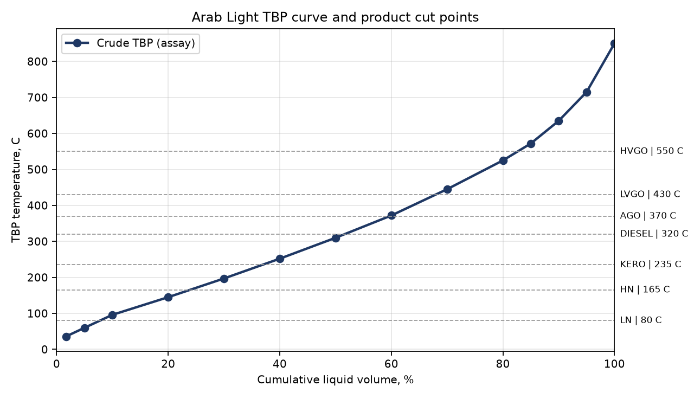

# 1 Introduction
This Basis of Design (BoD) defines the design premises for the 100 kBPSD Crude & Vacuum Distillation Unit (CDU/VDU). It is the governing
input for every deliverable in the FEED package; all numbers below are read by the calculation code in
`cfu/basis.py`, so this document and the calculations cannot diverge.

## 1.1 Scope
- Crude receipt from OSBL tankage, two-stage electrostatic desalting, crude preheat train (cold and hot trains).
- Atmospheric crude charge heater H-101 and atmospheric fractionator C-101 with three pumparounds and side strippers
  for kerosene, diesel and AGO.
- Overhead condensing system, naphtha stabiliser (debutaniser) C-105 and naphtha splitter C-106.
- Vacuum heater H-201, wet packed vacuum column C-201, three-stage steam ejector system and hotwell.
- Unit utility distribution (steam, BFW, CW, fuel gas, nitrogen, instrument air), unit flare knock-out, closed drains.
- Excluded (interfaces only): tankage, sour water stripper, LPG treating, flare stack, wastewater treatment,
  fuel gas production, central control room, main substation.

## 1.2 Capacity and operating envelope
| Item | Value |
|---|---|
| Design capacity | 100,000 BPSD (stream day) |
| On-stream factor | 95% (8,322 h/y) |
| Turndown | 50% of design |
| Hydraulic design margin | 10% on normal flows (pumps, lines, control valves) |
| Run length | 5 years between turnarounds |

# 2 Feedstock
| Property | Design crude | Check crude |
|---|---|---|
| Name | Arab Light (design) | Arab Heavy (check case) |
| API gravity | 33.4 | 27.7 |
| Sulfur, wt% | 1.8 | 2.8 |
| Salt as received, PTB | 20.0 | 30 |
| BS&W, vol% | 0.3 | 0.5 |
| TAN, mg KOH/g | 0.05 | 0.1 |
| Pour point, C | -30 | -27 |

Check case: Hydraulic/thermal check case; not simulated in Rev A.

## 2.1 TBP distillation (design crude)
| LV % | 1.7 | 5 | 10 | 20 | 30 | 40 | 50 | 60 | 70 | 80 | 85 | 90 | 95 | 100 |
|---|---|---|---|---|---|---|---|---|---|---|---|---|---|---|
| TBP C | 36 | 60 | 96 | 145 | 197 | 252 | 310 | 372 | 445 | 525 | 572 | 635 | 715 | 850 |

Light ends (LV% on crude): C2 0.05, C3 0.4, iC4 0.25, nC4 1.0.

# 3 Products and specifications
| Product | Specification / destination |
|---|---|
| LPG | C5+ <= 2 LV%; C2- <= 0.5 mol% (tie-in to LPG treating) |
| LN | TBP 36-80 degC; RVP <= 0.85 bar; to isomerisation |
| HN | TBP 80-165 degC; to NHT/reformer; ASTM D86 EP <= 185 degC |
| KERO | Flash >= 38 degC; D86 FBP <= 260 degC; to jet Merox/hydrotreater |
| DIESEL | D86 T95 <= 360 degC; flash >= 55 degC; to DHT |
| AGO | To DHT / FCC feed |
| LVGO | To hydrocracker; D1160 T95 <= 450 degC |
| HVGO | To FCC/hydrocracker; Ni+V <= 2 ppmw; CCR <= 0.8 wt% |
| VR | To delayed coker; 550 degC+ TBP |

Atmospheric cut points (TBP): LN 80 C, HN 165 C, KERO 235 C, DIESEL 320 C, AGO 370 C.
Vacuum cut points (TBP): LVGO 430 C, HVGO 550 C; VR = 550 C+.
Desalted crude: salt <= 1 PTB, BS&W <= 0.2 vol%. Brine oil content <= 100 ppmw.

# 4 Site and climatic data
| Item | Value |
|---|---|
| location | US Gulf Coast (generic) |
| elevation m | 5 |
| amb design C | 35.0 |
| amb min C | -5.0 |
| wet bulb C | 27.0 |
| rel humidity | 0.8 |
| wind design | ASCE 7, 150 mph (3-s gust) |
| seismic | ASCE 7, SDC B |
| units | SI (degC, bar, kg/h, m) |
| pressure ref | bar(g) unless noted (a) |

# 5 Utilities
| Utility | Conditions |
|---|---|
| hp steam | P_barg=41.4, T_C=400, note=600 psig header |
| mp steam | P_barg=10.3, T_C=250, note=150 psig header |
| lp steam | P_barg=3.5, T_C=180, note=50 psig header |
| cooling water | supply_C=32, return_C=43, P_barg=4.5 |
| bfw | T_C=120, P_barg=50 |
| fuel gas | LHV_MJ_kg=47.0, P_barg=3.5, MW=20.0 |
| instrument air | P_barg=7.0, dewpoint_C=-40 |
| nitrogen | P_barg=7.0 |
| power | utility_kV=13.8, mv_kV=4.16, lv_V=480, ac_hz=60, ups_V=120 |

# 6 Key process design parameters
| Parameter | Value |
|---|---|
| atm top P | 2.2 |
| atm drum P | 1.7 |
| atm tray dP | 0.008 |
| atm cot max | 370.0 |
| atm overflash lv | 0.03 |
| atm drum T | 45.0 |
| tl dP | 0.9 |
| tl dT | 5.0 |
| pa split | {'TPA': 0.17, 'MPA': 0.27, 'BPA': 0.26} |
| steam lb per bbl | {'bottom': 10, 'KERO': 6, 'DIESEL': 6, 'AGO': 6} |
| vac top P | 0.02 |
| vac fz P | 0.06 |
| vac cot max | 415.0 |
| vac tl dT | 12.0 |
| vac overflash lv | 0.03 |
| vac steam lb per bbl | {'bottom': 5, 'coil': 1.5} |
| vac pa split | {'LVGO': 0.4, 'HVGO': 0.6} |
| stab drum P | 11.5 |
| stab drum T | 45.0 |
| split drum P | 1.8 |
| split drum T | 50.0 |
| h101 eff | 0.9 |
| h201 eff | 0.88 |
| rad flux kW m2 | 31.5 |
| rad fraction | 0.65 |
| desalter T | 135.0 |
| wash water lv | 0.05 |
| min approach | 20.0 |

# 7 Design criteria
- Design pressure: max(1.1 x max. operating, operating + 1.7 bar), minimum 3.5 barg; vacuum equipment full vacuum.
- Design temperature: maximum operating + 28 C (rounded up to 5 C).
- Corrosion allowance: 3 mm general, 6 mm for hot sulfidic (> 260 C) and overhead sour service.
- Materials: per API 939-C (McConomy curves) and API 571: 5Cr / 9Cr for sulfidic service above 260 C, 410S
  cladding for column shells above 260 C, Monel 400 for the C-101 top section (HCl/NH4Cl dew point), Ti tubes in
  the overhead trim condenser, NACE MR0103 / HIC-resistant plate in wet H2S service.
- Fired heaters: API 560; average radiant flux 31.5 kW/m2 (H-101), 25 kW/m2 (H-201); efficiency 90 % (LHV) with APH.
- Exchangers: TEMA R / API 660, max. 650 m2 per shell, 20 C minimum approach, F >= 0.80.
- Pumps: API 610, 2 x 100 % (A/B), 10 % flow margin; spares on opposite electrical buses.
- Relief: API 520/521; all relief to closed flare header (hydrocarbon) via unit KO drum D-104.
- Instrumentation: ISA 5.1; DCS for regulatory control; SIS per IEC 61511 (SIL by LOPA); F&G separate.
- Electrical: NEC Art. 505 (Zone system), API RP 505 classification, IEEE 141/399 studies.

# 8 Codes and standards
| Code | Application |
|---|---|
| API 650 / 620 | Storage tanks (off-plot, interface only) |
| API 560 | Fired heaters |
| API 660 / TEMA R | Shell & tube exchangers |
| API 661 | Air-cooled heat exchangers |
| API 610 12th ed. | Centrifugal pumps |
| API 520 / 521 | Pressure relief sizing and disposal |
| API 537 | Flare details (interface) |
| ASME VIII Div.1 | Pressure vessels and columns |
| ASME B31.3 | Process piping |
| ASME B16.5 / B16.47 | Flanges |
| API RP 505 / IEC 60079-10-1 | Hazardous area classification (Zone system) |
| NFPA 70 (NEC) Art. 505 | Electrical installation in Zone-classified areas |
| IEEE 141 / 399 | Power system design and studies |
| ISA 5.1 / 5.4 / 5.2 | Instrument symbols, loop diagrams, binary logic |
| IEC 61511 / ISA 84 | Safety instrumented systems |
| IEC 62443 | Industrial cybersecurity (zones and conduits) |
| API 2218 / 2510A | Fireproofing / LPG spacing |
| CCPS / GAP 2.5.2 | Equipment spacing guidelines |
| NACE MR0103 / API 939-C / API 571 | Materials for sour, sulfidation, naphthenic service |

# 9 Environmental limits (design targets)
- Heater stacks: NOx <= 25 ppmv @ 3 % O2 (ultra-low-NOx burners); SO2 governed by fuel gas H2S <= 160 ppmv.
- No continuous hydrocarbon venting to atmosphere; vacuum off-gas burned in H-201.
- Sour water to SWS; desalter brine to WWT via oil-recovery; noise <= 85 dB(A) at 1 m.
