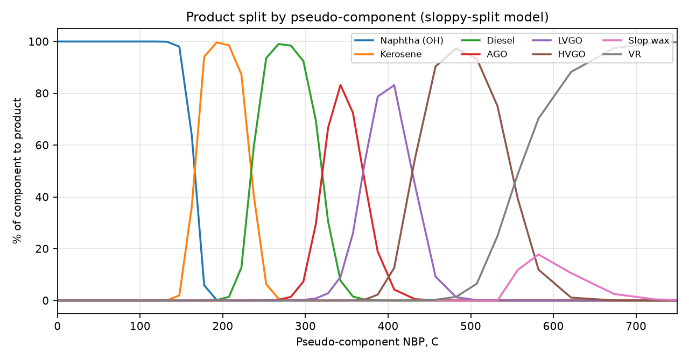
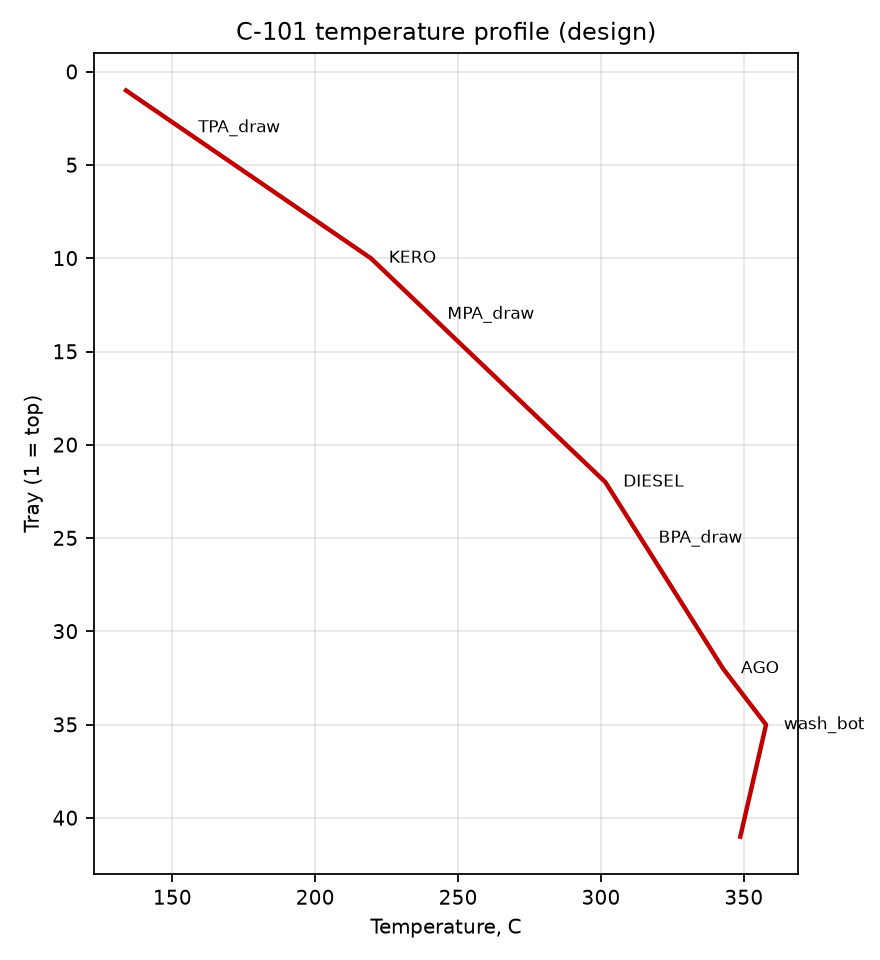
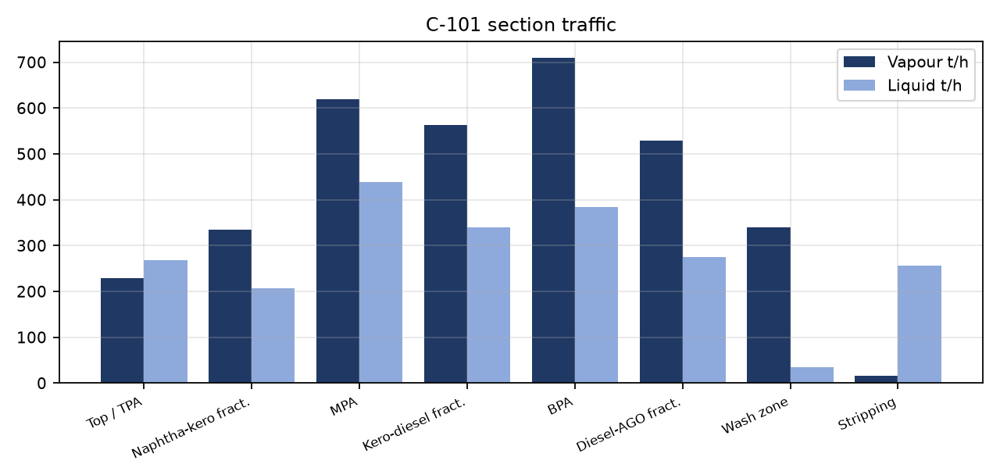
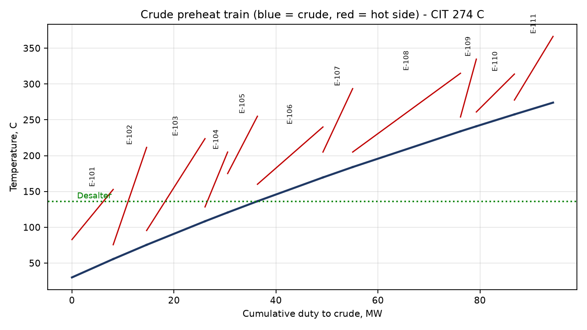

# 1 Purpose
This report documents the process simulation and equipment sizing basis for the 100 kBPSD Crude & Vacuum Distillation Unit
(FEED, Rev A). It summarises the method, the heat and material balance (full stream table in
CFU-000-PR-HMB-001) and the hydraulic and thermal sizing of the main equipment. Every number is produced by the
calculation code in this repository (`python build.py`). That code is the calculation record.

# 2 Method
## 2.1 Crude characterisation
The design crude TBP curve is split into 37 pseudo-components (15 C cuts to 395 C, 25 C to 595 C,
then 50 C), plus discrete light ends C2-nC4. Specific gravity uses a Watson K that varies with boiling point,
K = K0 - 0.00025 (Tb - 100), with K0 = 11.927 fitted to the bulk 33.4 API. MW, Tc and Pc
come from Riazi-Daubert (1987) and the acentric factor from Lee-Kesler. Vapour pressure uses Lee-Kesler
corresponding states. Enthalpy: Watson-Nelson liquid Cp, Fallon-Watson vapour Cp, Kistiakowsky latent heat at
Tb (reference liquid at 15 C). Sulfur is distributed by boiling point and scaled to 1.8 wt%.

## 2.2 Column modelling (cut-point model)
- Products are defined by TBP cut points with a sigmoid overlap ("sloppy split"); the width increases down the
  column, matching typical crude-unit ASTM gaps and overlaps.
- Flash zones: equilibrium (Raoult) flash with stripping steam as an inert. The flash-zone temperature is solved
  so that vapour = all distillates + overflash (3% LV on crude; vacuum
  3% LV on feed). COT = FZ + transfer-line temperature drop.
- Draw temperatures are the product bubble point at the tray's hydrocarbon partial pressure; steam and internal
  reflux are iterated with the heat balance.
- Total heat removal comes from the overall column enthalpy balance. It is split between top reflux and
  pumparounds (TPA 17%, MPA 27%, BPA 26%);
  internal reflux below each draw comes from envelope balances, and gives the section vapour and liquid loads
  used for tray sizing.
- Stabiliser and splitter: Fenske-Underwood-Gilliland short-cut, Fenske distribution of non-keys, Kirkbride feed
  stage, R = 1.3 Rmin, tray efficiency 75 %.
- Preheat train: sequential counter-current exchangers, minimum approach 20 C; the
  remaining duty goes to trim coolers or steam generators.

## 2.3 Limitations (FEED accuracy)
The thermodynamics are ideal (Raoult), and the model does not do tray-to-tray rigorous rating. Expect the
flash-zone and draw temperatures to be within about 5-10 C of a rigorous simulation (HYSYS/Petro-SIM). Before
detailed engineering, these numbers must be confirmed with a rigorous simulation on a full crude assay.

Model warnings:
- None

\pagebreak
# 3 Heat and material balance summary
## 3.1 Product yields
| Product | Stream | BPSD | t/h | wt% | API | TBP5 C | TBP95 C | S wt% |
|---|---|---|---|---|---|---|---|---|
| LPG | 30 | 1,743 | 6.5 | 1.14 | 120.8 | -76 | 39 | 0.001 |
| Light naphtha | 32 | 5,920 | 27.6 | 4.86 | 69.3 | 13 | 84 | 0.018 |
| Heavy naphtha | 33 | 16,275 | 80.8 | 14.23 | 57.0 | 83 | 167 | 0.055 |
| Kerosene | 16 | 13,017 | 68.6 | 12.08 | 46.2 | 163 | 239 | 0.238 |
| Diesel | 17 | 14,701 | 81.6 | 14.37 | 37.2 | 230 | 326 | 0.948 |
| AGO | 18 | 7,930 | 45.8 | 8.07 | 30.5 | 306 | 387 | 1.779 |
| LVGO | 23 | 8,467 | 50.4 | 8.87 | 25.9 | 350 | 451 | 2.295 |
| HVGO | 24 | 14,553 | 90.4 | 15.92 | 19.3 | 418 | 560 | 2.892 |
| Slop wax | 25 | 1,212 | 7.9 | 1.39 | 12.3 | 542 | 672 | 3.751 |
| Vacuum residue | 26 | 16,181 | 108.3 | 19.06 | 8.5 | 537 | 824 | 4.022 |

Overall hydrocarbon balance: products + off-gases = 567.87 t/h vs crude 567.87 t/h
(+0.000 %).

## 3.2 Fractionation quality (ASTM D86 estimated via Riazi-Daubert TBP-D86)
| Pair | Light D86 90% | Heavy D86 10% | Light D86 EP | Heavy D86 IBP | 5-95 gap (IBP-EP), C |
|---|---|---|---|---|---|
| Heavy naphtha / Kerosene | 150 | 184 | 172 | 181 | +9 |
| Kerosene / Diesel | 221 | 251 | 248 | 248 | +1 |
| Diesel / AGO | 303 | 322 | 335 | 327 | -8 |

A negative IBP-EP gap means overlap; typical crude-unit targets are a gap of +10 C (naphtha/kero) and an
overlap of 0 to -20 C (kero/diesel, diesel/AGO).

# 4 Atmospheric section
| Parameter | Value |
|---|---|
| Crude inlet temperature (CIT) | 274.0 C |
| Desalter temperature | 136.4 C |
| H-101 COT | 365.7 C |
| Flash zone T / P | 360.7 C / 1.47 barg |
| Column top T / P | 133.8 C / 1.19 barg |
| Top water dew point (margin) | 83.0 C (51 C) |
| Bottom T | 348.7 C |
| Reflux (to top tray) | 101.3 t/h (R/D = 0.88) |
| Draw temperatures K / D / AGO | 220 / 302 / 343 C |
| Total heat removal | 47.58 MW |
| Overhead condensing duty | 39.70 MW |
| Stripping steam bottom/K/D/AGO, kg/h | 7638 / 1476 / 1667 / 899 |

| Pumparound | Draw tray | Return tray | Duty MW | Draw T C | Return T C | Circulation t/h |
|---|---|---|---|---|---|---|
| TPA | 3 | 1 | 8.09 | 153 | 83 | 167 |
| MPA | 13 | 11 | 12.85 | 240 | 160 | 208 |
| BPA | 25 | 23 | 12.37 | 314 | 224 | 166 |

## 4.1 C-101 tray hydraulics (Fair flooding, 80 % flood, 85 % net area)
| Section | Trays | V t/h | L t/h | T C | rho V | rho L | FLV | TS mm | u flood m/s | D calc m |
|---|---|---|---|---|---|---|---|---|---|---|
| Top / TPA | 1-3 | 229 | 268 | 139 | 5.02 | 611 | 0.106 | 760 | 1.12 | 4.60 |
| Naphtha-kero fract. | 4-9 | 335 | 207 | 181 | 5.61 | 651 | 0.057 | 610 | 1.02 | 5.51 |
| MPA | 11-13 | 620 | 438 | 233 | 7.53 | 599 | 0.079 | 760 | 0.94 | 6.74 |
| Kero-diesel fract. | 14-21 | 564 | 339 | 267 | 8.08 | 621 | 0.069 | 610 | 0.81 | 6.68 |
| BPA | 23-25 | 710 | 384 | 310 | 9.24 | 578 | 0.068 | 760 | 0.85 | 6.85 |
| Diesel-AGO fract. | 26-31 | 529 | 275 | 326 | 9.49 | 610 | 0.065 | 610 | 0.75 | 6.23 |
| Wash zone | 33-35 | 339 | 34 | 358 | 6.03 | 635 | 0.010 | 610 | 1.07 | 5.24 |
| Stripping | 36-41 | 15 | 257 | 354 | 1.60 | 706 | 0.796 | 610 | 0.82 | 2.47 |

Selected: ID 6.9 m (top/main) / 4.1 m (stripping) x 36.0 m T/T. Internals: 41 valve trays (2/4-pass), 410S; Monel-lined top 5 trays.

\pagebreak
# 5 Crude preheat train
| Exchanger | Hot stream | Duty MW | Hot in/out C | Crude in/out C |
|---|---|---|---|---|
| E-101 | TPA | 8.09 | 153 / 83 | 30 / 56 |
| E-102 | KERO | 6.55 | 212 / 76 | 56 / 75 |
| E-103 | LVGO | 11.45 | 224 / 95 | 75 / 108 |
| E-104 | DIESEL | 4.44 | 205 / 128 | 108 / 121 |
| E-105 | VR | 5.84 | 255 / 175 | 121 / 136 |
| E-106 | MPA | 12.85 | 240 / 160 | 136 / 170 |
| E-107 | DIESEL | 5.83 | 294 / 205 | 170 / 184 |
| E-108 | HVGO | 21.14 | 315 / 205 | 184 / 234 |
| E-109 | AGO | 3.11 | 335 / 254 | 234 / 241 |
| E-110 | BPA | 7.46 | 314 / 261 | 241 / 258 |
| E-111 | VR | 7.58 | 366 / 278 | 258 / 274 |

| Exchanger | Area m2 | U W/m2K | F | Shells (series x parallel) |
|---|---|---|---|---|
| E-101 | 359 | 330 | 0.94 | 1 x 1 |
| E-102 | 438 | 300 | 0.82 | 1 x 1 |
| E-103 | 804 | 280 | 0.93 | 2 x 1 |
| E-104 | 378 | 290 | 0.91 | 1 x 1 |
| E-105 | 431 | 170 | 0.97 | 1 x 1 |
| E-106 | 1001 | 320 | 0.94 | 2 x 1 |
| E-107 | 324 | 290 | 0.94 | 1 x 1 |
| E-108 | 2196 | 250 | 0.87 | 2 x 2 |
| E-109 | 263 | 260 | 0.95 | 1 x 1 |
| E-110 | 886 | 280 | 0.86 | 1 x 2 |
| E-111 | 1094 | 170 | 0.86 | 1 x 2 |

Trim duties (heat not recovered to crude):
| Tag | Stream | Type | Duty MW | T C |
|---|---|---|---|---|
| E-113 | BPA | MP steam generator | 4.91 | 261 -> 224 |
| A-103 | KERO | air cooler | 1.27 | 76 -> 45 |
| A-104 | DIESEL | air cooler | 3.72 | 128 -> 55 |
| A-105 | AGO | air cooler | 6.06 | 254 -> 60 |
| A-201 | LVGO | air cooler | 3.10 | 95 -> 55 |
| E-201 | VR | LP steam generator | 1.78 | 278 -> 255 |
| A-202 | HVGO product | air cooler | 6.64 | 205 -> 90 |

# 6 Fired heaters
| Item | H-101 | H-201 |
|---|---|---|
| Process duty, MW | 59.55 | 14.69 |
| Absorbed duty, MW | 60.68 | 14.69 |
| Fired duty (LHV), MW | 67.42 | 16.7 |
| Efficiency | 0.9 | 0.88 |
| Inlet T, C | 274.0 | 349.0 |
| Outlet T (COT), C | 365.7 | 398.4 |
| Outlet P, bar(a) | 3.38 | 0.31 |
| Outlet vapour fraction (mass) | 0.533 | 0.264 |
| Radiant duty, MW | 38.71 | 9.55 |
| Radiant area, m2 | 1229.0 | 382.0 |
| Radiant tubes (6 in x 18.3 m) | 128 | 40 |
| Passes | 8 | 4 |
| Mass flux, kg/m2s | 1176.0 | 1066.0 |
| Burners | 16 | 6 |
| Fuel gas, kg/h | 5164.0 | 1279.0 |

# 7 Vacuum section
| Parameter | Value |
|---|---|
| Feed (atmospheric residue) | 256.9 t/h, 268 m3/h |
| H-201 COT | 398.4 C |
| Flash zone T / P | 386.4 C / 60 mbar(a) |
| Top T / P | 70 C / 20 mbar(a) |
| LVGO / HVGO draw T | 224 / 315 C |
| Bottom T (quenched) | 366 C |
| Stripping + coil steam | 2789 kg/h |
| Total heat removal | 22.59 MW (LVGO PA 9.0, HVGO PA 13.6) |
| Ejector motive steam | 9352 kg/h MP steam |

C-201 bed sizing (packing at Cs = 0.11 m/s, wash grid 0.12 m/s; stripping trays at 75 % flood):
| Section | V t/h | L t/h | T C | P mbar | rho V | Q m3/s | D calc m |
|---|---|---|---|---|---|---|---|
| Bed 1 - LVGO PA | 10.4 | 83 | 147 | 22 | 0.037 | 79 | 2.49 |
| Bed 2 - LVGO/HVGO fract. | 87.2 | 34 | 285 | 34 | 0.176 | 138 | 4.97 |
| Bed 3 - HVGO PA | 177.6 | 161 | 347 | 44 | 0.283 | 174 | 6.41 |
| Bed 4 - Wash | 151.9 | 13 | 382 | 56 | 0.307 | 137 | 5.50 |
| Flash zone | 151.9 | 108 | 386 | 60 | 0.327 | 129 | 5.60 |
| Stripping | 5.0 | 108 | 371 | 70 | 0.041 | 35 | 2.49 |

Selected: ID 2.6 m (top) / 6.6 m (main) / 3.0 m (boot) x 36.0 m T/T.

# 8 Light ends
| Item | C-105 stabiliser | C-106 splitter |
|---|---|---|
| Light / heavy key | nC4 / iC5-range pseudo | NBP<80 / NBP>80 pseudo |
| Top / bottom P, bar(a) | 11.80 / 12.30 | 2.10 / 2.50 |
| Top / bottom T, C | 79 / 203 | 84 / 152 |
| Nmin / Rmin / R | 7.2 / 1.45 / 1.89 | 14.6 / 1.60 / 2.08 |
| Theoretical / actual trays | 15.2 / 19 | 29.5 / 38 |
| Feed tray (from top) | 13 | 21 |
| Condenser / reboiler duty, MW | 2.14 / 10.83 | 9.63 / 6.83 |
| Diameter x height | ID 2.1 m x 18.0 m T/T | ID 3.1 m x 29.5 m T/T |

# 9 Pumps
| Tag | Service | Rated m3/h | Head m | Abs. kW | Motor kW | API 610 |
|---|---|---|---|---|---|---|
| P-101A/B | Crude charge | 730 | 261 | 617 | 710 | BB2 |
| P-102A/B | Desalted crude booster | 805 | 263 | 616 | 710 | BB2 |
| P-103A/B | Atm. reflux | 159 | 102 | 46 | 55 | OH2 |
| P-104A/B | Unstabilised naphtha | 180 | 232 | 119 | 160 | OH2 |
| P-105A/B | Overhead sour water | 14 | 51 | 3 | 5.5 | OH2 |
| P-106A/B | TPA pumparound | 293 | 130 | 94 | 110 | OH2 |
| P-107A/B | MPA pumparound | 387 | 138 | 123 | 160 | BB2 |
| P-108A/B | BPA pumparound | 318 | 142 | 102 | 132 | BB2 |
| P-109A/B | Kero product | 122 | 148 | 46 | 55 | BB2 |
| P-110A/B | Diesel product | 151 | 154 | 56 | 75 | BB2 |
| P-111A/B | Ago product | 84 | 153 | 32 | 45 | BB2 |
| P-112A/B | Atm. residue / vacuum heater charge | 398 | 172 | 189 | 250 | BB2 |
| P-114A/B | Desalter wash water | 37 | 82 | 13 | 18.5 | OH2 |
| P-115A/B | Stabiliser reflux / LPG | 39 | 154 | 14 | 18.5 | OH2 |
| P-116A/B | Splitter reflux / LN | 146 | 111 | 43 | 55 | OH2 |
| P-117A/B | Heavy naphtha product | 142 | 98 | 36 | 45 | OH2 |
| P-118 | Desalter mud-wash / recycle | 19 | 64 | 5 | 7.5 | OH2 |
| P-201A/B | LVGO pumparound / product | 198 | 138 | 81 | 110 | BB2 |
| P-202A/B | HVGO pumparound / product | 391 | 144 | 155 | 200 | BB2 |
| P-203A/B | Slop wax | 12 | 114 | 5 | 5.5 | BB2 |
| P-204A/B | Vacuum residue (incl. quench) | 196 | 187 | 112 | 132 | BB2 |
| P-205A/B | Hotwell sour water | 13 | 51 | 3 | 3.7 | OH2 |
| P-206A/B | Hotwell slop oil | 1 | 60 | 0 | 0.75 | OH2 |

# 10 Relief loads (preliminary governing cases)
| Tag | Protects | Case | Load kg/h | Set barg | Orifice |
|---|---|---|---|---|---|
| PSV-1001 | C-101 | Reflux failure / blocked OH (total OH vapour) | 216,219 | 2.4 | 4 x T |
| PSV-1002 | D-101A | Fire (liquid full) | 50,292 | 15.5 | 1 x M |
| PSV-1003 | D-101B | Fire (liquid full) | 50,292 | 15.5 | 1 x M |
| PSV-1004 | D-102 | Fire | 12,890 | 2.4 | 1 x P |
| PSV-1005 | C-105 | Reflux failure (reboiler duty) | 129,912 | 13.0 | 1 x R |
| PSV-1006 | D-105 | Fire | 5,902 | 15.2 | 1 x H |
| PSV-1007 | C-106 | Reflux failure (reboiler duty) | 76,867 | 3.5 | 1 x T |
| PSV-1008 | E-116 | Tube rupture (HP steam into naphtha) | 25,000 | 13.0 | 1 x P |
| PSV-1009 | C-102/103/104 | Fire (side strippers) | 15,948 | 3.5 | 1 x N |
| PSV-1010 | P-101 disch. | Blocked outlet / thermal | 5,000 | 30.0 | 1 x E |
| PSV-2001 | C-201 | Loss of vacuum / fire (blocked outlet to ejectors) | 32,789 | 3.5 | 1 x R |
| PSV-2002 | D-201 | Fire | 6,324 | 3.5 | 1 x K |

The global flare load (power failure, cooling failure) is assessed in the flare study. The largest single unit
contributor is the C-101 overhead (reflux failure).
