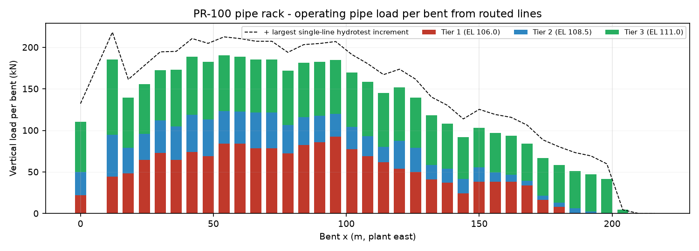

# CFU-000-PI-RPT-001 Piping Routing Study and Stress-Critical Line List

## 1 Purpose and scope

FEED piping routing study for the 100 kBPSD crude + vacuum distillation unit. The study establishes the pipe-rack and equipment piping arrangement in a 3D orthogonal routing model (`data/routing.json`, 3D model CFU-000-PI-3DM-002, viewer `viewer-piping.html`), issues isometrics for the layout- and stress-critical lines, quantifies rack loading, lists stress-critical lines with simplified flexibility checks, and derives pipe wall thicknesses and the MTO (CFU-000-PI-MTO-001). All inputs are read at build time from `data/lines.json` (line list), `data/layout.json` (plot plan, nozzles, rack), `data/instruments.json`, `data/psv.json` and `data/mech.json`.

- Lines in line list: **245**; routed: **182** (13 critical/isometric, 11 unit headers, 158 study-level auto-routed); not routed: **50** (reasons in section 4 and MTO sheet Line-List-Crosscheck).

- Routed pipe 11,813 m net (12,956 m incl. allowance), 1,486 fittings, 428 flanges, 4,448 butt welds (25,828 shop + 11,720 field inch-dia), 1,359 spools, 2,153 supports.

## 2 Codes and references

- ASME B31.3-2022 Process Piping (wall thickness 304.1.2, flexibility 319, testing 345, PWHT 331, NDE 341)

- ASME B36.10M, B16.5, B16.47 Series A, B16.9, B16.10, B16.20; MSS SP-58/69 supports

- API 610 12th ed. (pump nozzle loads, Table 5), API 560 (fired heater terminals), API 661 (air-cooler nozzles), API 521 (relief/flare piping), WRC 537/297 (vessel nozzle local stresses)

- CFU-000-PI-SPC-001 Piping class summary; CFU-000-PL-PLT-001 plot plan; CFU-000-PL-ELV-003 rack section; CONVENTIONS.md (rack tiers EL 106.0 / 108.5 / 111.0, bents at 6 m)

## 3 Routing philosophy

- **Orthogonal routing** nozzle -> stub -> drop/rise -> rack tier -> along rack -> off rack -> destination nozzle. Lines change elevation to change direction ('elevation by direction'): local north-south pipeways at EL 104.0, east-west at EL 105.4; exchanger-area pipeway EL 104.6.

- **Rack tier allocation:** tier 1 (EL 106.0) hot process B2/B3, crude, residue, pumparounds (T >= 260 C); tier 2 (EL 108.5) products, cold hydrocarbon, sour water; tier 3 (EL 111.0) utilities, steam, condensate, CW, fuel gas, flare. Hot / loop-bearing lines are placed at the rack edges so loops span the rack width; heaviest lines next to the bent columns.

- **Rack entry/exit:** tier-1 lines leave the rack below the tier (clear of tier-1 loops), tier-2/3 lines rise above their tier; minimum rise = 2 x LR elbow + 150 mm. Expansion loops are raised one rise above the tier (tier 2 loops drop below), nested loops step 0.9 m inwards and 0.45 m up; tier-3 loops avoid bays below the forced-draft air coolers (fan deck EL 113).

- **Expansion:** dL = e(T) x L with e from B31.3 Table C-1 (total expansion from 21 C, per class material). Rack runs are first checked for absorption by the end legs (guided cantilever, anchor at mid-run); otherwise U-loops of width 6 m (one bay) are sized: H = sqrt(3 E D (dL_loop/2) / S_A), S_A = 1.25 Sc + 0.25 Sh.

- **Pump suctions:** shortest route, no pockets, header falling to the pumps, gate valve in the vertical leg, temporary cone strainer, eccentric reducer FLAT ON TOP at the nozzle; discharge check + block in the riser.

- **Heater transfer lines:** symmetrical multi-pass outlet manifolds (equal hydraulic length per pass), continuously rising (H-101, two-phase) or riser + continuous 1:100 fall (H-201 vacuum) to the column; 54" vacuum transfer line designed for full vacuum.

- **C-101 overhead:** self-draining at 1:200 from column to A-101 with symmetrical inlet manifold to the three bays; neutraliser/amine injection quills within 1.5 m of the column nozzle.

- **Gravity draws (C-101 to strippers):** vertical drop then continuous fall 1:100, no rising leg.

- **Steam:** branches from top of headers; lines fall to users; drip legs/traps at low points. **Relief:** PSV outlets self-draining into the flare header (falls 1:500 to D-104).

- **Spools:** shop spools <= 12 m and 3.0 x 3.0 m envelope (road transport); field welds at spool breaks, tie-ins and branch connections; high-point vents / low-point drains at every pocket.

## 4 Routing model summary

| Level | Lines | Routed length m | Supports |
|---|---|---|---|
| header | 11 | 1,683 | 261 |
| critical | 13 | 927 | 158 |
| study | 158 | 10,104 | 1734 |

Lines not routed at FEED (by reason):

| Reason | No. | Lines (fluid-area-seq) |
|---|---|---|
| small bore (< 2") - field routed | 13 | CH-100-011, CH-100-025, BD-100-057, BFW-100-078, 1/2"-FG-100, CH-100-118, CH-100-119, SW-100-130 ... |
| header not routed (underground / virtual) | 3 | BD-100-012, BD-100-091, BD-900-018 |
| endpoint '...' not a located nozzle/header (P&ID tie-in to another line or heater coil) -  | 34 | P-100-016, WW-100-030, WW-100-031, P-100-046, P-100-054, MS-100-058, P-100-059, P-100-060 ... |

Clash check (cylinder model, bare OD): **16** line/equipment and **161** line/line interferences, of which **0** / **7** involve critical (iso) lines - all line/line items with critical lines are crossings with auto-routed study lines that are to be re-routed in the detailed 3D model; critical lines are clash-free with equipment and each other.

## 5 Critical lines and isometric register

| Iso | Line | From -> to | Routed m | Spools | Welds S/F | Supports | Sheets |
|---|---|---|---|---|---|---|---|
| CFU-100-PI-ISO-001 | 28"-P-100-075-B3-H | H-101 outlet manifold -> C-101 flash zone | 89.9 | 17 | 30/19 | 17 | 1 |
| CFU-200-PI-ISO-001 | 54"-P-200-017-B3-H | H-201 outlet manifold -> C-201 flash zone | 89.5 | 13 | 17/14 | 14 | 1 |
| CFU-100-PI-ISO-002 | 36"-PG-100-107-A2-H | C-101 top -> A-101 | 85.9 | 11 | 26/13 | 12 | 1 |
| CFU-100-PI-ISO-003 | 14"-P-100-084-B2-H | C-101 bottom -> P-112A/B | 24.5 | 7 | 23/2 | 6 | 1 |
| CFU-100-PI-ISO-004 | 10"-P-100-085-B2-H | P-112A/B -> H-201 inlet manifold | 219.5 | 33 | 89/32 | 30 | 3 |
| CFU-100-PI-ISO-005 | 20"-P-100-001-A1-N | TK (OSBL) -> P-101A/B | 43.4 | 11 | 32/6 | 9 | 1 |
| CFU-100-PI-ISO-006 | 12"-P-100-002-B1-N | P-101A/B -> E-101 | 65.4 | 12 | 43/10 | 10 | 1 |
| CFU-100-PI-ISO-007 | 12"-P-100-050-B2-H | C-101 tray 25 -> P-108A/B | 49.2 | 9 | 29/5 | 12 | 1 |
| CFU-100-PI-ISO-008 | 8"-P-100-053-B1-H | E-113 -> C-101 tray 23 | 148.4 | 17 | 38/15 | 24 | 1 |
| CFU-100-PI-ISO-009 | 10"-P-100-092-B1-H | C-101 tray 10 -> C-102 | 31.0 | 3 | 8/2 | 7 | 1 |
| CFU-100-PI-ISO-010 | 10"-P-100-110-A2-N | D-102 -> P-103A/B | 23.0 | 7 | 25/2 | 6 | 1 |
| CFU-100-PI-ISO-011 | 10"-P-100-112-A2-N | D-102 -> P-104A/B | 18.0 | 7 | 25/2 | 4 | 1 |
| CFU-100-PI-ISO-012 | 6"-HS-100-135-S2-H | HP steam header -> E-116 | 39.5 | 5 | 11/6 | 7 | 1 |

\pagebreak

## 6 Pipe-rack loading

Line weights per metre = pipe (selected schedule) + operating content (lines.json density) + insulation (thickness per temperature, 160 kg/m3 + cladding). Load per bent = w x tributary length (6 m); loops add (2H + W) w / 2 to each loop bent. Hydrotest: operating rack load + the largest single-line water-fill increment (one line tested at a time; large gas lines tested pneumatically or with temporary supports). Friction (mu = 0.3) acts longitudinally at anchors/guides.

| Tier | Max lines / bent | Max op. load kN | Equiv. UDL kN/m (10 m beam) | Max hydro increment kN | Max friction kN | Total tier kN |
|---|---|---|---|---|---|---|
| Tier 1 EL 106.0 | 16 | 92 @ x=96 | 9.2 | 5 | 20 | 1,706 |
| Tier 2 EL 108.5 | 18 | 50 @ x=12 | 5.0 | 2 | 12 | 846 |
| Tier 3 EL 111.0 | 13 | 90 @ x=12 | 9.0 | 33 | 27 | 1,957 |

| Bent x m | Tier 1 kN | Tier 2 kN | Tier 3 kN | Total kN |
|---|---|---|---|---|
| 12 | 44 | 50 | 90 | 185 |
| 42 | 74 | 44 | 70 | 189 |
| 54 | 84 | 39 | 67 | 191 |
| 60 | 84 | 39 | 66 | 189 |
| 66 | 78 | 43 | 64 | 185 |
| 72 | 78 | 43 | 64 | 185 |

Recommendation to structural: design each tier beam for the routed load above plus 25 % future space allowance and a minimum 2.0 kPa distributed load over the rack width; anchor bents to take the anchor forces from the loops (see section 7).

Rack occupancy (routed lines per tier): tier 1 20, tier 2 22, tier 3 14 (full width 10 m, 25 % spare to be held).

## 7 Expansion loops on the rack

| Line | Tier | T C | Run m | dL mm | Loops | H m | Basis |
|---|---|---|---|---|---|---|---|
| 2"-P-200-031-B2-ST | 1 | 410.0 | 177.3 | 834.3 | 2 | 6.5 | loops raised |
| 6"-P-200-008-B2-ST | 1 | 395 | 157.1 | 708.1 | 8 | 5.0 | loops raised |
| 3"-P-200-034-B1-ST | 1 | 395.0 | 136.1 | 690.2 | 0 | - | end legs, mid anchor |
| 10"-MS-900-009-S3-H | 3 | 280 | 197.4 | 653.3 | 0 | - | end legs, mid anchor |
| 10"-P-200-005-B2-H | 1 | 345 | 159.6 | 614.3 | 4 | 8.5 | loops raised |
| 6"-P-200-001-B1-H | 2 | 255 | 162.6 | 479.9 | 2 | 8.0 | loops raised |
| 28"-FL-900-005-F1-N | 3 | 280.0 | 137.4 | 454.9 | 0 | - | end legs, mid anchor |
| 6"-P-200-041-B1-ST | 2 | 235.0 | 165.0 | 441.6 | 2 | 7.5 | loops raised |
| 4"-P-100-105-B1-ST | 1 | 285.0 | 123.0 | 415.9 | 1 | 8.5 | loops raised |
| 4"-P-100-049-B1-H | 1 | 365 | 85.0 | 390.6 | 4 | 4.5 | loops raised |
| 6"-P-200-002-B1-H | 2 | 255 | 131.3 | 387.5 | 2 | 7.0 | loops raised |
| 10"-P-100-044-B1-H | 1 | 270 | 116.1 | 367.3 | 4 | 6.5 | loops raised |
| 6"-HS-900-008-S2-H | 3 | 430 | 64.8 | 354.1 | 0 | - | end legs, mid anchor |
| 10"-P-100-085-B2-H | 1 | 380.0 | 80.9 | 348.5 | 3 | 7.5 | loops raised |
| 6"-P-100-020-B1-H | 1 | 325 | 82.5 | 327.4 | 0 | - | end legs, mid anchor |
| 4"-P-100-048-B2-H | 1 | 365 | 78.8 | 324.0 | 0 | - | end legs, mid anchor |
| 6"-P-100-047-B2-H | 1 | 325 | 89.8 | 322.1 | 0 | - | end legs, mid anchor |
| 18"-P-100-042-B2-H | 1 | 305 | 91.0 | 303.2 | 0 | - | end legs, mid anchor |
| 10"-LS-900-010-S1-H | 3 | 210 | 121.5 | 283.4 | 0 | - | end legs, mid anchor |
| 8"-P-100-045-B1-H | 1 | 270 | 82.7 | 261.9 | 0 | - | end legs, mid anchor |
| 8"-P-100-051-B2-H | 1 | 345 | 55.6 | 214.0 | 2 | 6.5 | loops raised |
| 8"-P-100-014-A1-H | 2 | 185 | 102.7 | 205.2 | 1 | 8.5 | loops raised |
| 6"-P-100-104-A1-N | 2 | 160.0 | 117.0 | 194.6 | 1 | 7.0 | loops raised |
| 6"-P-100-151-A1-N | 2 | 185.0 | 63.0 | 125.8 | 1 | 6.0 | loops raised |

\pagebreak

## 8 Stress-critical line list

Criteria (company practice, B31.3 319.4.1): **Category 1 (formal computer analysis, CAESAR II):** T > 300 C and NPS >= 6; T > 200 C and NPS >= 12; lines to rotating equipment (NPS >= 4 and T >= 150 C, or NPS >= 12); fired-heater inlet/outlet/pass lines; vacuum lines NPS >= 6; air-cooler headers (T > 120 C, NPS >= 6); NPS >= 24; flare/relief headers NPS >= 12; 600# class with T > 200 C, NPS >= 4; any routed line above 150 C failing the simplified eq.(16). **Category 2 (simplified/manual):** T > 150 C or equipment-connected NPS >= 4. **Category 3:** visual review.

Result: **Category 1: 127 lines**, Category 2: 46, Category 3: 72.

| Line (Cat 1) | T C | P barg | Criteria | Model |
|---|---|---|---|---|
| 20"-P-100-001-A1-N | 60.0 | 3.7 | rotating equipment (API 610 nozzle loads) | iso CFU-100-PI-ISO-005 |
| 12"-P-100-002-B1-N | 60.0 | 35.0 | rotating equipment (API 610 nozzle loads) | iso CFU-100-PI-ISO-006 |
| 12"-P-100-009-B1-H | 165 | 35.0 | fails simplified eq.(16) | routed |
| 12"-P-100-013-A1-H | 185 | 3.5 | rotating equipment (API 610 nozzle loads) | routed |
| 8"-P-100-014-A1-H | 185 | 13.5 | rotating equipment (API 610 nozzle loads) | routed |
| 6"-P-100-016-A1-H | 185 | 13.5 | rotating equipment (API 610 nozzle loads) | - |
| 6"-P-100-017-B1-H | 240 | 14.5 | rotating equipment (API 610 nozzle loads) | routed |
| 6"-P-100-018-B1-H | 240 | 14.5 | air cooler header (API 661 nozzle loads) | routed |
| 6"-P-100-019-B1-H | 325 | 14.5 | T > 300 C & NPS >= 6 | routed |
| 6"-P-100-020-B1-H | 325 | 14.5 | T > 300 C & NPS >= 6; air cooler header (API 661 nozzle loads) | routed |
| 20"-P-100-022-B1-H | 165 | 17.0 | rotating equipment (API 610 nozzle loads) | routed |
| 12"-P-100-023-B1-H | 165.0 | 41.0 | rotating equipment (API 610 nozzle loads) | routed |
| 8"-P-100-024-B1-H | 165.0 | 41.0 | rotating equipment (API 610 nozzle loads) | routed |
| 10"-FL-100-035-F1-N | 230 | 3.5 | fails simplified eq.(16) | routed |
| 10"-FL-100-036-F1-N | 230 | 3.5 | fails simplified eq.(16) | routed |
| 14"-P-100-038-B1-H | 215 | 41.0 | T > 200 C & NPS >= 12 | routed |
| 14"-P-100-039-B1-H | 265 | 41.0 | T > 200 C & NPS >= 12 | routed |
| 14"-P-100-040-B1-H | 270 | 41.0 | T > 200 C & NPS >= 12 | routed |
| 14"-P-100-041-C1-H | 290 | 41.0 | T > 200 C & NPS >= 12; 600# class & T > 200 C | routed |
| 18"-P-100-042-B2-H | 305 | 41.0 | T > 300 C & NPS >= 6; T > 200 C & NPS >= 12; fired heater terminal (AP | routed |
| 14"-P-100-043-B1-H | 270 | 3.5 | T > 200 C & NPS >= 12; rotating equipment (API 610 nozzle loads) | routed |
| 10"-P-100-044-B1-H | 270 | 13.5 | rotating equipment (API 610 nozzle loads) | routed |
| 6"-P-100-047-B2-H | 325 | 14.5 | T > 300 C & NPS >= 6; rotating equipment (API 610 nozzle loads) | routed |
| 4"-P-100-048-B2-H | 365 | 14.5 | rotating equipment (API 610 nozzle loads) | routed |
| 12"-P-100-050-B2-H | 345 | 3.5 | T > 300 C & NPS >= 6; T > 200 C & NPS >= 12; rotating equipment (API 6 | iso CFU-100-PI-ISO-007 |
| 8"-P-100-051-B2-H | 345 | 13.5 | T > 300 C & NPS >= 6; rotating equipment (API 610 nozzle loads) | routed |
| 12"-MS-100-058-S1-H | 215 | 3.5 | T > 200 C & NPS >= 12 | - |
| 6"-P-100-059-B2-H | 305 | 38.5 | T > 300 C & NPS >= 6; fired heater terminal (API 560) | - |
| 6"-P-100-060-B2-H | 305 | 38.5 | T > 300 C & NPS >= 6; fired heater terminal (API 560) | - |
| 6"-P-100-061-B2-H | 305 | 38.5 | T > 300 C & NPS >= 6; fired heater terminal (API 560) | - |
| 6"-P-100-062-B2-H | 305 | 38.5 | T > 300 C & NPS >= 6; fired heater terminal (API 560) | - |
| 6"-P-100-063-B2-H | 305 | 38.5 | T > 300 C & NPS >= 6; fired heater terminal (API 560) | - |
| 6"-P-100-064-B2-H | 305 | 38.5 | T > 300 C & NPS >= 6; fired heater terminal (API 560) | - |
| 6"-P-100-065-B2-H | 305 | 38.5 | T > 300 C & NPS >= 6; fired heater terminal (API 560) | - |
| 6"-P-100-066-B2-H | 305 | 38.5 | T > 300 C & NPS >= 6; fired heater terminal (API 560) | - |
| 8"-P-100-067-B3-H | 545.0 | 18.7 | T > 300 C & NPS >= 6; fired heater terminal (API 560) | - |
| 8"-P-100-068-B3-H | 545.0 | 18.7 | T > 300 C & NPS >= 6; fired heater terminal (API 560) | - |
| 8"-P-100-069-B3-H | 545.0 | 18.7 | T > 300 C & NPS >= 6; fired heater terminal (API 560) | - |
| 8"-P-100-070-B3-H | 545.0 | 18.7 | T > 300 C & NPS >= 6; fired heater terminal (API 560) | - |
| 8"-P-100-071-B3-H | 545.0 | 18.7 | T > 300 C & NPS >= 6; fired heater terminal (API 560) | - |
| 8"-P-100-072-B3-H | 545.0 | 18.7 | T > 300 C & NPS >= 6; fired heater terminal (API 560) | - |
| 8"-P-100-073-B3-H | 545.0 | 18.7 | T > 300 C & NPS >= 6; fired heater terminal (API 560) | - |
| 8"-P-100-074-B3-H | 545.0 | 18.7 | T > 300 C & NPS >= 6; fired heater terminal (API 560) | - |
| 28"-P-100-075-B3-H | 545.0 | 18.7 | T > 300 C & NPS >= 6; T > 200 C & NPS >= 12; fired heater terminal (AP | iso CFU-100-PI-ISO-001 |
| 12"-LS-100-077-S1-H | 380 | 6.2 | T > 300 C & NPS >= 6; T > 200 C & NPS >= 12 | - |
| 14"-P-100-084-B2-H | 390.0 | 3.5 | T > 300 C & NPS >= 6; T > 200 C & NPS >= 12; rotating equipment (API 6 | iso CFU-100-PI-ISO-003 |
| 10"-P-100-085-B2-H | 380.0 | 24.0 | T > 300 C & NPS >= 6; rotating equipment (API 610 nozzle loads); fired | iso CFU-100-PI-ISO-004 |
| 6"-P-100-086-B2-H | 380.0 | 24.0 | T > 300 C & NPS >= 6; rotating equipment (API 610 nozzle loads) | - |
| 10"-LS-100-087-S1-H | 380 | 6.2 | T > 300 C & NPS >= 6; fails simplified eq.(16) | routed |
| 8"-LS-100-088-S1-H | 380 | 6.2 | T > 300 C & NPS >= 6; fails simplified eq.(16) | routed |
| 8"-P-100-089-B2-H | 375 | 3.5 | T > 300 C & NPS >= 6; fails simplified eq.(16) | routed |
| 10"-P-100-092-B1-H | 250 | 3.5 | fails simplified eq.(16) | iso CFU-100-PI-ISO-009 |
| 10"-P-100-093-B2-H | 330 | 3.5 | T > 300 C & NPS >= 6; fails simplified eq.(16) | routed |
| 8"-PG-100-094-B1-H | 250.0 | 3.5 | fails simplified eq.(16) | routed |
| 8"-PG-100-095-B2-H | 330.0 | 3.5 | T > 300 C & NPS >= 6 | routed |
| 6"-PG-100-096-B2-H | 375.0 | 3.5 | T > 300 C & NPS >= 6; fails simplified eq.(16) | routed |
| 8"-P-100-097-B1-H | 250.0 | 3.5 | rotating equipment (API 610 nozzle loads) | routed |
| 6"-LS-100-098-S1-H | 380 | 6.2 | T > 300 C & NPS >= 6; fails simplified eq.(16) | routed |
| 8"-P-100-099-B2-H | 330.0 | 3.5 | T > 300 C & NPS >= 6; rotating equipment (API 610 nozzle loads) | routed |
| 6"-LS-100-100-S1-H | 380 | 6.2 | T > 300 C & NPS >= 6; fails simplified eq.(16) | routed |
| 6"-P-100-101-B2-H | 375.0 | 3.5 | T > 300 C & NPS >= 6; rotating equipment (API 610 nozzle loads) | routed |
| 4"-LS-100-102-S1-H | 380 | 6.2 | fails simplified eq.(16) | routed |
| 6"-P-100-104-A1-N | 160.0 | 14.5 | air cooler header (API 661 nozzle loads) | routed |
| 6"-FL-100-106-F1-N | 330 | 3.5 | T > 300 C & NPS >= 6; fails simplified eq.(16) | routed |
| 36"-PG-100-107-A2-H | 165.0 | 3.5 | air cooler header (API 661 nozzle loads); NPS >= 24; fails simplified  | iso CFU-100-PI-ISO-002 |
| 16"-PG-100-108-A2-N | 165.0 | 9.7 | air cooler header (API 661 nozzle loads) | routed |
| 24"-FL-100-120-F1-N | 185 | 3.5 | NPS >= 24; flare / relief header (reaction forces) | routed |
| 6"-PG-100-123-C1-H | 235.0 | 13.0 | air cooler header (API 661 nozzle loads); 600# class & T > 200 C | routed |
| 12"-P-100-131-C1-H | 430.0 | 13.0 | T > 300 C & NPS >= 6; T > 200 C & NPS >= 12; 600# class & T > 200 C | routed |
| 12"-PG-100-132-C1-H | 430.0 | 13.0 | T > 300 C & NPS >= 6; T > 200 C & NPS >= 12; 600# class & T > 200 C; f | routed |
| 6"-P-100-133-C1-H | 430.0 | 13.0 | T > 300 C & NPS >= 6; 600# class & T > 200 C | routed |
| 6"-P-100-134-C1-H | 235.0 | 13.0 | 600# class & T > 200 C | routed |
| 6"-HS-100-135-S2-H | 430 | 46.0 | T > 300 C & NPS >= 6; 600# class & T > 200 C; fails simplified eq.(16) | iso CFU-100-PI-ISO-012 |
| 4"-CD-100-136-S2-P | 430.0 | 45.0 | 600# class & T > 200 C | - |
| 24"-FL-100-138-F1-N | 125 | 3.5 | NPS >= 24; flare / relief header (reaction forces) | routed |
| 24"-FL-100-140-F1-N | 290 | 3.5 | T > 200 C & NPS >= 12; NPS >= 24; flare / relief header (reaction forc | routed |
| 20"-PG-100-141-A1-H | 185.0 | 3.5 | air cooler header (API 661 nozzle loads) | routed |
| 16"-P-100-147-B1-H | 280.0 | 3.5 | T > 200 C & NPS >= 12; fails simplified eq.(16) | routed |
| 20"-P-100-148-B1-H | 280.0 | 3.5 | T > 200 C & NPS >= 12 | routed |
| 8"-P-100-149-A1-H | 185.0 | 3.5 | rotating equipment (API 610 nozzle loads) | routed |
| 6"-P-100-150-A1-H | 185.0 | 11.0 | rotating equipment (API 610 nozzle loads); air cooler header (API 661  | routed |
| 6"-P-100-151-A1-N | 185.0 | 11.0 | air cooler header (API 661 nozzle loads) | routed |
| 8"-MS-100-152-S3-H | 280 | 13.0 | fails simplified eq.(16) | routed |
| 6"-CD-100-153-S1-P | 215 | 13.0 | fails simplified eq.(16) | routed |
| 16"-FL-100-154-F1-N | 130 | 3.5 | flare / relief header (reaction forces) | routed |
| 6"-P-200-001-B1-H | 255 | 15.5 | rotating equipment (API 610 nozzle loads) | routed |
| 6"-P-200-002-B1-H | 255 | 15.5 | air cooler header (API 661 nozzle loads) | routed |
| 6"-P-200-003-B2-ST | 395 | 20.5 | T > 300 C & NPS >= 6 | routed |
| 6"-P-200-004-B1-ST | 310 | 20.5 | T > 300 C & NPS >= 6 | routed |
| 10"-P-200-005-B2-H | 345 | 15.5 | T > 300 C & NPS >= 6; rotating equipment (API 610 nozzle loads) | routed |
| 8"-P-200-006-B1-H | 345 | 15.5 | T > 300 C & NPS >= 6 | - |
| 6"-P-200-007-B2-H | 345 | 15.5 | T > 300 C & NPS >= 6 | - |
| 6"-P-200-008-B2-ST | 395 | 20.5 | T > 300 C & NPS >= 6; rotating equipment (API 610 nozzle loads) | routed |
| 6"-P-200-009-B2-H | 580.0 | 24.0 | T > 300 C & NPS >= 6; fired heater terminal (API 560) | - |
| 6"-P-200-010-B2-H | 580.0 | 24.0 | T > 300 C & NPS >= 6; fired heater terminal (API 560) | - |
| 6"-P-200-011-B2-H | 580.0 | 24.0 | T > 300 C & NPS >= 6; fired heater terminal (API 560) | - |
| 6"-P-200-012-B2-H | 580.0 | 24.0 | T > 300 C & NPS >= 6; fired heater terminal (API 560) | - |
| 12"-P-200-013-B3-H | 580.0 | 3.5 | T > 300 C & NPS >= 6; T > 200 C & NPS >= 12; fired heater terminal (AP | - |
| 12"-P-200-014-B3-H | 580.0 | 3.5 | T > 300 C & NPS >= 6; T > 200 C & NPS >= 12; fired heater terminal (AP | - |
| 12"-P-200-015-B3-H | 580.0 | 3.5 | T > 300 C & NPS >= 6; T > 200 C & NPS >= 12; fired heater terminal (AP | - |
| 12"-P-200-016-B3-H | 580.0 | 3.5 | T > 300 C & NPS >= 6; T > 200 C & NPS >= 12; fired heater terminal (AP | - |
| 54"-P-200-017-B3-H | 580.0 | 3.5 | T > 300 C & NPS >= 6; T > 200 C & NPS >= 12; fired heater terminal (AP | iso CFU-200-PI-ISO-001 |
| 3"-MS-200-018-S3-H | 280 | 12.0 | fired heater terminal (API 560) | - |
| 48"-PG-200-024-V1-H | 180 | 3.5 | rotating equipment (API 610 nozzle loads); vacuum / external pressure; | routed |
| 10"-P-200-025-B1-H | 255.0 | 3.5 | rotating equipment (API 610 nozzle loads) | routed |
| 14"-P-200-027-B2-H | 345.0 | 3.5 | T > 300 C & NPS >= 6; T > 200 C & NPS >= 12; rotating equipment (API 6 | routed |
| 8"-P-200-028-B1-H | 345 | 15.5 | T > 300 C & NPS >= 6 | - |
| 4"-MS-200-032-S3-H | 280 | 12.0 | fails simplified eq.(16) | routed |
| 10"-P-200-033-B2-ST | 395.0 | 3.5 | T > 300 C & NPS >= 6; rotating equipment (API 610 nozzle loads); fails | routed |
| 4"-P-200-035-B2-ST | 395.0 | 20.5 | rotating equipment (API 610 nozzle loads) | routed |
| 16"-FL-200-036-F1-N | 430 | 3.5 | T > 300 C & NPS >= 6; T > 200 C & NPS >= 12; flare / relief header (re | routed |
| 6"-P-200-038-B1-N | 255 | 15.5 | air cooler header (API 661 nozzle loads) | - |
| 6"-P-200-040-B1-H | 345 | 15.5 | T > 300 C & NPS >= 6; air cooler header (API 661 nozzle loads) | - |
| 6"-P-200-041-B1-ST | 235.0 | 15.5 | air cooler header (API 661 nozzle loads) | routed |
| 6"-MS-200-047-S3-H | 280 | 12.0 | rotating equipment (API 610 nozzle loads) | routed |
| 2"-MS-200-049-S3-H | 280 | 12.0 | fails simplified eq.(16) | routed |
| 42"-PG-200-050-A2-P | 250.0 | 3.5 | T > 200 C & NPS >= 12; rotating equipment (API 610 nozzle loads); vacu | routed |
| 10"-PG-200-051-A2-P | 250.0 | 3.5 | rotating equipment (API 610 nozzle loads); vacuum / external pressure | routed |
| 6"-PG-200-053-A2-N | 100.0 | 3.5 | vacuum / external pressure | routed |
| 28"-FL-900-004-F1-N | 280.0 | 3.5 | T > 200 C & NPS >= 12; NPS >= 24; flare / relief header (reaction forc | routed |
| 28"-FL-900-005-F1-N | 280.0 | 3.5 | T > 200 C & NPS >= 12; NPS >= 24; flare / relief header (reaction forc | routed |
| 6"-HS-900-008-S2-H | 430 | 45.5 | T > 300 C & NPS >= 6; 600# class & T > 200 C; fails simplified eq.(16) | routed |
| 10"-MS-900-009-S3-H | 280 | 12.0 | fails simplified eq.(16) | routed |
| 10"-LS-900-010-S1-H | 210 | 6.2 | fails simplified eq.(16) | routed |
| 6"-MS-900-011-S3-H | 280 | 12.0 | fails simplified eq.(16) | routed |
| 8"-CD-900-012-S1-P | 215 | 6.7 | fails simplified eq.(16) | routed |
| 6"-BD-900-018-B1-N | 395 | 10.0 | T > 300 C & NPS >= 6 | - |

\pagebreak

## 9 Simplified flexibility checks

ASME B31.3 eq.(16) (SI): D y / (L - U)^2 <= 208.3, D = OD mm, y = resultant displacement mm (thermal growth of the straight line between terminals minus differential terminal movement - column nozzle growth from skirt base at shell design temperature), L = developed length m, U = anchor distance m. Applicable only to two-anchor systems of uniform size without intermediate restraints - lines with rack anchors/loops or failing the check go to formal analysis.

| Line | Level | L m | U m | y mm | Dy/(L-U)^2 | Eq.16 | Cat |
|---|---|---|---|---|---|---|---|
| 28"-FL-900-004-F1-N | head | 71.8 | 58.0 | 193.4 | 725 | FORMAL | Cat 1 |
| 10"-MS-900-009-S3-H | head | 197.4 | 197.4 | 653.3 | inf | FORMAL | Cat 1 |
| 10"-LS-900-010-S1-H | head | 121.5 | 121.5 | 283.4 | inf | FORMAL | Cat 1 |
| 8"-CD-900-012-S1-P | head | 53.4 | 53.4 | 128.1 | inf | FORMAL | Cat 1 |
| 6"-HS-900-008-S2-H | head | 64.8 | 64.8 | 354.1 | inf | FORMAL | Cat 1 |
| 2"-BFW-900-013-C1-H | head | 47.0 | 47.0 | 71.9 | inf | FORMAL | Cat 3 |
| 28"-P-100-075-B3-H | crit | 61.0 | 46.5 | 309.4 | 1050 | FORMAL | Cat 1 |
| 54"-P-200-017-B3-H | crit | 71.0 | 54.3 | 380.5 | 1884 | FORMAL | Cat 1 |
| 36"-PG-100-107-A2-H | crit | 63.2 | 35.8 | 177.3 | 217 | FORMAL | Cat 1 |
| 14"-P-100-084-B2-H | crit | 19.4 | 13.3 | 56.0 | 524 | FORMAL | Cat 1 |
| 10"-P-100-085-B2-H | crit | 211.1 | 98.3 | 423.4 | 9 | OK | Cat 1 |
| 20"-P-100-001-A1-N | crit | 36.5 | 16.3 | 7.3 | 9 | OK | Cat 1 |
| 12"-P-100-002-B1-N | crit | 58.0 | 21.1 | 9.4 | 2 | OK | Cat 1 |
| 12"-P-100-050-B2-H | crit | 43.1 | 26.7 | 67.5 | 82 | OK | Cat 1 |
| 8"-P-100-053-B1-H | crit | 143.8 | 62.4 | 193.2 | 6 | OK | Cat 2 |
| 10"-P-100-092-B1-H | crit | 31.0 | 23.7 | 83.1 | 425 | FORMAL | Cat 1 |
| 10"-P-100-110-A2-N | crit | 17.3 | 10.4 | 4.8 | 27 | OK | Cat 2 |
| 10"-P-100-112-A2-N | crit | 13.8 | 8.0 | 6.2 | 51 | OK | Cat 2 |
| 6"-HS-100-135-S2-H | crit | 39.5 | 28.6 | 156.3 | 220 | FORMAL | Cat 1 |
| 12"-P-100-008-B1-H | stud | 14.2 | 3.7 | 5.7 | 17 | OK | Cat 3 |
| 12"-P-100-009-B1-H | stud | 65.5 | 53.7 | 92.9 | 218 | FORMAL | Cat 1 |
| 8"-P-100-010-B1-H | stud | 17.1 | 6.2 | 9.4 | 17 | OK | Cat 3 |
| 12"-P-100-013-A1-H | stud | 83.4 | 51.2 | 139.4 | 44 | OK | Cat 1 |
| 8"-P-100-014-A1-H | stud | 181.0 | 111.4 | 222.5 | 10 | OK | Cat 1 |
| 8"-P-100-015-A1-H | stud | 178.7 | 85.2 | 198.9 | 5 | OK | Cat 2 |
| 6"-P-100-017-B1-H | stud | 156.4 | 89.3 | 245.2 | 9 | OK | Cat 1 |
| 6"-P-100-018-B1-H | stud | 154.1 | 93.1 | 255.6 | 12 | OK | Cat 1 |
| 6"-P-100-019-B1-H | stud | 40.4 | 22.5 | 89.4 | 47 | OK | Cat 1 |
| 6"-P-100-020-B1-H | stud | 148.9 | 88.9 | 352.8 | 16 | OK | Cat 1 |
| 12"-P-100-021-B1-H | stud | 22.2 | 11.4 | 17.3 | 48 | OK | Cat 2 |
| 20"-P-100-022-B1-H | stud | 43.4 | 25.0 | 44.5 | 66 | OK | Cat 1 |
| 12"-P-100-023-B1-H | stud | 80.3 | 49.5 | 85.6 | 29 | OK | Cat 1 |
| 8"-P-100-024-B1-H | stud | 46.1 | 27.3 | 45.2 | 28 | OK | Cat 1 |
| 3"-WW-100-028-A3-P | stud | 40.4 | 26.6 | 37.4 | 18 | OK | Cat 3 |
| 3"-WW-100-029-A3-P | stud | 25.8 | 12.8 | 17.3 | 9 | OK | Cat 2 |
| 3"-WW-100-033-A3-P | stud | 31.1 | 16.1 | 19.5 | 8 | OK | Cat 3 |
| 3"-WW-100-034-A3-P | stud | 20.8 | 12.0 | 21.2 | 24 | OK | Cat 3 |
| 10"-FL-100-035-F1-N | stud | 23.2 | 16.5 | 43.0 | 265 | FORMAL | Cat 1 |
| 10"-FL-100-036-F1-N | stud | 33.2 | 26.2 | 68.3 | 385 | FORMAL | Cat 1 |
| 12"-P-100-037-B1-H | stud | 17.7 | 7.1 | 15.6 | 46 | OK | Cat 2 |
| 14"-P-100-038-B1-H | stud | 14.2 | 3.7 | 8.9 | 29 | OK | Cat 1 |
| 14"-P-100-039-B1-H | stud | 24.7 | 14.1 | 43.5 | 138 | OK | Cat 1 |
| 14"-P-100-040-B1-H | stud | 14.5 | 3.7 | 11.8 | 36 | OK | Cat 1 |
| 14"-P-100-041-C1-H | stud | 49.4 | 29.9 | 103.2 | 96 | OK | Cat 1 |
| 18"-P-100-042-B2-H | stud | 175.4 | 110.1 | 366.8 | 39 | OK | Cat 1 |
| 14"-P-100-043-B1-H | stud | 111.8 | 51.2 | 145.9 | 14 | OK | Cat 1 |
| 10"-P-100-044-B1-H | stud | 217.0 | 121.6 | 384.8 | 12 | OK | Cat 1 |
| 8"-P-100-045-B1-H | stud | 164.8 | 90.6 | 267.0 | 11 | OK | Cat 2 |
| 6"-P-100-047-B2-H | stud | 128.7 | 95.1 | 341.3 | 51 | OK | Cat 1 |
| 4"-P-100-048-B2-H | stud | 116.8 | 84.1 | 346.0 | 37 | OK | Cat 1 |
| 4"-P-100-049-B1-H | stud | 178.1 | 88.4 | 406.4 | 6 | OK | Cat 2 |
| 8"-P-100-051-B2-H | stud | 113.9 | 61.2 | 235.6 | 19 | OK | Cat 1 |
| 8"-P-100-052-B2-H | stud | 28.4 | 17.1 | 53.9 | 92 | OK | Cat 2 |
| 2"-BFW-100-055-C1-H | stud | 50.8 | 39.8 | 60.9 | 30 | OK | Cat 3 |
| 6"-MS-100-056-S3-H | stud | 44.5 | 33.6 | 116.0 | 164 | OK | Cat 2 |
| 10"-LS-100-087-S1-H | stud | 30.3 | 25.1 | 139.9 | 1396 | FORMAL | Cat 1 |
| 8"-LS-100-088-S1-H | stud | 33.7 | 26.1 | 132.4 | 508 | FORMAL | Cat 1 |
| 8"-P-100-089-B2-H | stud | 28.9 | 21.2 | 102.9 | 381 | FORMAL | Cat 1 |
| 4"-P-100-090-B2-H | stud | 10.2 | 4.9 | 2.7 | 11 | OK | Cat 2 |
| 10"-P-100-093-B2-H | stud | 29.2 | 19.9 | 75.4 | 236 | FORMAL | Cat 1 |
| 8"-PG-100-094-B1-H | stud | 31.5 | 23.2 | 84.3 | 266 | FORMAL | Cat 1 |
| 8"-PG-100-095-B2-H | stud | 29.7 | 19.8 | 75.3 | 168 | OK | Cat 1 |
| 6"-PG-100-096-B2-H | stud | 29.2 | 21.5 | 102.6 | 288 | FORMAL | Cat 1 |
| 8"-P-100-097-B1-H | stud | 25.1 | 13.6 | 38.3 | 63 | OK | Cat 1 |
| 6"-LS-100-098-S1-H | stud | 33.7 | 26.1 | 132.4 | 390 | FORMAL | Cat 1 |
| 8"-P-100-099-B2-H | stud | 24.7 | 13.6 | 48.9 | 88 | OK | Cat 1 |
| 6"-LS-100-100-S1-H | stud | 33.6 | 26.0 | 135.1 | 399 | FORMAL | Cat 1 |
| 6"-P-100-101-B2-H | stud | 24.0 | 13.7 | 57.2 | 92 | OK | Cat 1 |
| 4"-LS-100-102-S1-H | stud | 33.8 | 26.3 | 137.0 | 274 | FORMAL | Cat 1 |
| 6"-P-100-104-A1-N | stud | 142.6 | 117.2 | 195.0 | 51 | OK | Cat 1 |
| 4"-P-100-105-B1-ST | stud | 155.8 | 123.4 | 417.1 | 45 | OK | Cat 2 |
| 6"-FL-100-106-F1-N | stud | 26.9 | 25.4 | 102.8 | 7721 | FORMAL | Cat 1 |
| 16"-PG-100-108-A2-N | stud | 37.0 | 20.7 | 35.9 | 55 | OK | Cat 1 |
| 24"-FL-100-120-F1-N | stud | 55.4 | 38.7 | 77.4 | 170 | OK | Cat 1 |
| 6"-FL-100-121-F1-N | stud | 21.0 | 16.8 | 25.7 | 241 | FORMAL | Cat 3 |
| 6"-PG-100-123-C1-H | stud | 33.1 | 21.3 | 70.0 | 84 | OK | Cat 1 |
| 2"-PG-100-124-C1-H | stud | 32.0 | 19.3 | 28.6 | 11 | OK | Cat 2 |
| 12"-P-100-131-C1-H | stud | 14.5 | 6.2 | 33.0 | 152 | OK | Cat 1 |
| 12"-PG-100-132-C1-H | stud | 11.2 | 6.1 | 32.5 | 413 | FORMAL | Cat 1 |
| 6"-P-100-133-C1-H | stud | 17.8 | 8.4 | 47.1 | 89 | OK | Cat 1 |
| 6"-P-100-134-C1-H | stud | 43.2 | 28.0 | 50.9 | 37 | OK | Cat 1 |
| 24"-FL-100-140-F1-N | stud | 44.2 | 34.5 | 119.1 | 762 | FORMAL | Cat 1 |
| 20"-PG-100-141-A1-H | stud | 48.4 | 28.4 | 52.2 | 66 | OK | Cat 1 |
| 6"-PG-100-143-A1-H | stud | 48.2 | 30.6 | 21.8 | 12 | OK | Cat 2 |
| 16"-P-100-147-B1-H | stud | 12.1 | 5.3 | 24.0 | 213 | FORMAL | Cat 1 |
| 20"-P-100-148-B1-H | stud | 16.3 | 5.3 | 25.1 | 105 | OK | Cat 1 |
| 8"-P-100-149-A1-H | stud | 29.8 | 17.5 | 33.9 | 49 | OK | Cat 1 |
| 6"-P-100-150-A1-H | stud | 26.2 | 16.5 | 33.0 | 60 | OK | Cat 1 |
| 6"-P-100-151-A1-N | stud | 86.9 | 63.4 | 126.6 | 39 | OK | Cat 1 |
| 8"-MS-100-152-S3-H | stud | 32.8 | 27.3 | 90.3 | 649 | FORMAL | Cat 1 |
| 6"-CD-100-153-S1-P | stud | 39.4 | 34.1 | 81.8 | 483 | FORMAL | Cat 1 |
| 6"-P-200-001-B1-H | stud | 259.7 | 170.2 | 502.4 | 11 | OK | Cat 1 |
| 6"-P-200-002-B1-H | stud | 218.3 | 136.0 | 401.2 | 10 | OK | Cat 1 |
| 6"-P-200-003-B2-ST | stud | 44.9 | 31.8 | 143.4 | 142 | OK | Cat 1 |
| 6"-P-200-004-B1-ST | stud | 20.0 | 8.3 | 31.2 | 39 | OK | Cat 1 |
| 10"-P-200-005-B2-H | stud | 265.8 | 165.1 | 635.5 | 17 | OK | Cat 1 |
| 6"-P-200-008-B2-ST | stud | 317.6 | 164.8 | 742.8 | 5 | OK | Cat 1 |
| 48"-PG-200-024-V1-H | stud | 55.4 | 32.7 | 207.9 | 492 | FORMAL | Cat 1 |
| 10"-P-200-025-B1-H | stud | 69.8 | 43.5 | 120.6 | 48 | OK | Cat 1 |
| 14"-P-200-027-B2-H | stud | 57.8 | 36.6 | 93.3 | 73 | OK | Cat 1 |
| 2"-P-200-029-B2-H | stud | 47.6 | 30.1 | 83.4 | 16 | OK | Cat 2 |
| 3"-P-200-030-B2-H | stud | 41.5 | 25.9 | 74.0 | 27 | OK | Cat 2 |
| 2"-P-200-031-B2-ST | stud | 223.7 | 181.7 | 854.7 | 29 | OK | Cat 2 |
| 4"-MS-200-032-S3-H | stud | 22.2 | 18.3 | 94.8 | 693 | FORMAL | Cat 1 |
| 10"-P-200-033-B2-ST | stud | 24.5 | 15.9 | 61.9 | 226 | FORMAL | Cat 1 |
| 3"-P-200-034-B1-ST | stud | 201.2 | 138.3 | 701.5 | 16 | OK | Cat 2 |
| 4"-P-200-035-B2-ST | stud | 33.2 | 17.8 | 65.8 | 32 | OK | Cat 1 |
| 16"-FL-200-036-F1-N | stud | 57.2 | 41.3 | 232.4 | 371 | FORMAL | Cat 1 |
| 6"-P-200-041-B1-ST | stud | 213.5 | 165.2 | 442.0 | 32 | OK | Cat 1 |
| 6"-P-200-042-B1-ST | stud | 72.3 | 47.3 | 159.9 | 43 | OK | Cat 2 |
| 2"-BFW-200-043-C1-H | stud | 50.8 | 39.8 | 60.9 | 30 | OK | Cat 3 |
| 6"-LS-200-044-S1-H | stud | 51.7 | 40.5 | 89.0 | 121 | OK | Cat 2 |
| 6"-MS-200-047-S3-H | stud | 25.9 | 18.0 | 59.4 | 160 | OK | Cat 1 |
| 3"-MS-200-048-S3-H | stud | 20.9 | 15.8 | 52.2 | 179 | OK | Cat 2 |
| 2"-MS-200-049-S3-H | stud | 17.9 | 15.1 | 50.1 | 400 | FORMAL | Cat 1 |
| 42"-PG-200-050-A2-P | stud | 19.2 | 5.6 | 16.0 | 92 | OK | Cat 1 |
| 10"-PG-200-051-A2-P | stud | 11.0 | 5.5 | 15.9 | 146 | OK | Cat 1 |
| 3"-PG-200-052-A2-P | stud | 10.2 | 5.5 | 15.9 | 64 | OK | Cat 2 |
| 4"-FL-200-071-F1-N | stud | 44.6 | 34.8 | 53.2 | 63 | OK | Cat 3 |
| 28"-FL-900-005-F1-N | stud | 201.0 | 146.6 | 478.1 | 115 | OK | Cat 1 |
| 3"-BD-900-006-A1-N | stud | 19.4 | 6.7 | 18.5 | 10 | OK | Cat 2 |
| 6"-MS-900-011-S3-H | stud | 9.2 | 7.2 | 23.7 | 999 | FORMAL | Cat 1 |

Guided-cantilever leg check used for loops / end legs: required leg L = sqrt(3 E D dL / S_A) (E cold modulus B31.3 Table C-6; S_A allowable displacement stress range).

## 10 Pump nozzle loads (API 610)

Pump suction/discharge piping for P-101, P-103/104, P-108 and P-112 is arranged so that the pump-side spring support carries the weight of valves/strainers, the first rigid support is adjustable, and the loop between pump and header provides flexibility. Computed nozzle loads shall not exceed API 610 Table 5 (2x for Annex F method with vendor agreement). Hot services (P-108 345 C, P-112 390 C) need warm-up bypasses and formal analysis with both pumps' operating/standby cases. Nozzle sizes below are assumed pending vendor data.

| Nozzle | Fx N | Fy N | Fz N | FR N | Mx N.m | My N.m | Mz N.m | MR N.m |
|---|---|---|---|---|---|---|---|---|
| 2" | 710 | 580 | 890 | 1,280 | 460 | 230 | 350 | 620 |
| 3" | 1,070 | 890 | 1,330 | 1,930 | 950 | 470 | 720 | 1,280 |
| 4" | 1,420 | 1,160 | 1,780 | 2,560 | 1,330 | 680 | 1,000 | 1,800 |
| 6" | 2,490 | 2,050 | 3,110 | 4,480 | 2,300 | 1,180 | 1,760 | 3,130 |
| 8" | 3,780 | 3,110 | 4,890 | 6,920 | 3,530 | 1,760 | 2,580 | 4,710 |
| 10" | 5,340 | 4,450 | 6,670 | 9,630 | 5,020 | 2,440 | 3,800 | 6,750 |
| 12" | 6,670 | 5,340 | 8,000 | 11,700 | 6,100 | 2,980 | 4,610 | 8,210 |
| 14" | 7,120 | 5,780 | 8,900 | 12,780 | 6,370 | 3,120 | 4,750 | 8,540 |
| 16" | 8,450 | 6,670 | 10,230 | 14,850 | 7,320 | 3,660 | 5,420 | 9,890 |

## 11 Fired-heater terminals (API 560)

- H-101 / H-201 pass outlets join symmetrical manifolds on the heater north face; manifolds and the first transfer-line spool are supported from the heater structure on variable springs so that the coil terminal loads remain within API 560 Table 7 allowables (typical 8"-12" terminals: F 2.2-4.4 kN, M 1.4-3.4 kN.m; to be confirmed by heater vendor).

- Coil terminal thermal movements (heater vendor) shall be included in the transfer-line analysis; the routing gives transfer lines of 61 m (H-101) and 71 m (H-201) developed length.

- Inlet pass lines with pass flow control valves are part of the heater inlet manifold (vendor-coordinated).

## 12 Valve list summary

| Type | Class | Isos | Study routes | P&ID est. | Total | Sizes |
|---|---|---|---|---|---|---|
| check | A1 | 0 | 14 | 2 | 16 | 2", 3", 4", 6", 8" |
| check | A2 | 0 | 4 | 0 | 4 | 2" |
| check | A3 | 0 | 4 | 0 | 4 | 3" |
| check | B1 | 2 | 14 | 0 | 16 | 6", 8", 10", 12" |
| check | B2 | 2 | 16 | 2 | 20 | 2", 4", 6", 8", 10" |
| check | C1 | 0 | 4 | 0 | 4 | 2", 3" |
| control | A1 | 0 | 12 | 2 | 14 | 1", 2", 3", 4", 6", 8", 18" |
| control | A2 | 0 | 4 | 0 | 4 | 2", 4" |
| control | A3 | 0 | 2 | 1 | 3 | 2" |
| control | B1 | 2 | 11 | 4 | 17 | 2", 3", 4", 6", 8", 10", 12", 18" |
| control | B2 | 1 | 5 | 12 | 18 | 2", 4", 6", 8", 10" |
| control | C1 | 0 | 6 | 0 | 6 | 2", 4" |
| control | S1 | 0 | 5 | 2 | 7 | 3", 4", 6", 8", 10" |
| control | S3 | 0 | 3 | 1 | 4 | 2", 3", 4", 6" |
| control | V1 | 0 | 1 | 0 | 1 | 42" |
| gate | A1 | 3 | 56 | 11 | 70 | 1", 1-1/2", 2", 3", 4", 6", 8", 10", 12" |
| gate | A2 | 6 | 19 | 0 | 25 | 2", 3", 4", 6", 10" |
| gate | A3 | 0 | 11 | 2 | 13 | 3" |
| gate | B1 | 10 | 48 | 13 | 71 | 1", 3", 4", 6", 8", 10", 12", 14", 16",  |
| gate | B2 | 10 | 39 | 27 | 76 | 2", 3", 4", 6", 8", 10", 12", 14" |
| gate | C1 | 0 | 23 | 2 | 25 | 1", 2", 3", 6", 12" |
| gate | F1 | 0 | 13 | 0 | 13 | 3", 4", 6", 10", 16", 24", 28" |
| gate | S1 | 0 | 20 | 7 | 27 | 4", 6", 8", 10", 12" |
| gate | S2 | 1 | 1 | 0 | 2 | 6" |
| gate | S3 | 0 | 15 | 3 | 18 | 2", 3", 4", 6", 8", 10" |
| gate | U1 | 0 | 11 | 0 | 11 | 3", 6", 12", 18" |
| gate | U2 | 0 | 2 | 0 | 2 | 1", 1-1/2" |
| gate | V1 | 0 | 2 | 0 | 2 | 48" |
| gate (PSV outlet, CSO) | A1 | 0 | 0 | 1 | 1 | 2" |
| gate (PSV outlet, CSO) | S1 | 0 | 0 | 2 | 2 | 8", 12" |
| gate (vent/drain) | A1 | 1 | 50 | 6 | 57 | 3/4", 1" |
| gate (vent/drain) | A2 | 1 | 40 | 0 | 41 | 3/4", 1" |
| gate (vent/drain) | A3 | 0 | 12 | 4 | 16 | 3/4" |
| gate (vent/drain) | B1 | 6 | 72 | 16 | 94 | 3/4", 1" |
| gate (vent/drain) | B2 | 12 | 42 | 32 | 86 | 1", 1-1/2" |
| gate (vent/drain) | B3 | 4 | 0 | 24 | 28 | 1", 1-1/2" |
| gate (vent/drain) | C1 | 0 | 32 | 0 | 32 | 3/4" |
| gate (vent/drain) | F1 | 0 | 28 | 0 | 28 | 3/4" |
| gate (vent/drain) | S1 | 0 | 18 | 14 | 32 | 3/4" |
| gate (vent/drain) | S2 | 2 | 2 | 2 | 6 | 3/4", 1" |
| gate (vent/drain) | S3 | 0 | 16 | 2 | 18 | 3/4" |
| gate (vent/drain) | U1 | 0 | 20 | 0 | 20 | 3/4" |
| gate (vent/drain) | V1 | 0 | 2 | 0 | 2 | 3/4" |
| globe | A1 | 0 | 12 | 2 | 14 | 1", 2", 3", 4", 6", 8", 18" |
| globe | A2 | 0 | 4 | 0 | 4 | 2", 4" |
| globe | A3 | 0 | 2 | 1 | 3 | 2" |
| globe | B1 | 2 | 11 | 4 | 17 | 2", 3", 4", 6", 8", 10", 18" |
| globe | B2 | 1 | 5 | 12 | 18 | 2", 4", 6", 8" |
| globe | C1 | 0 | 6 | 0 | 6 | 2", 4" |
| globe | S1 | 0 | 5 | 2 | 7 | 3", 4", 6", 8", 10" |
| globe | S2 | 1 | 0 | 0 | 1 | 6" |
| globe | S3 | 0 | 4 | 1 | 5 | 2", 3", 4", 6" |
| globe | V1 | 0 | 1 | 0 | 1 | 42" |
| on/off (SDV) | A1 | 0 | 2 | 1 | 3 | 3", 8" |
| on/off (SDV) | C1 | 0 | 1 | 0 | 1 | 2" |
| spectacle blind | A1 | 1 | 5 | 1 | 7 | 1", 6", 8", 20" |
| spectacle blind | A2 | 0 | 1 | 0 | 1 | 6" |
| spectacle blind | A3 | 0 | 1 | 0 | 1 | 3" |
| spectacle blind | B1 | 0 | 3 | 3 | 6 | 1", 4", 6" |
| spectacle blind | C1 | 0 | 2 | 1 | 3 | 1", 2" |
| spectacle blind | F1 | 0 | 1 | 0 | 1 | 28" |
| spectacle blind | S1 | 0 | 2 | 0 | 2 | 8", 10" |
| spectacle blind | S2 | 0 | 1 | 0 | 1 | 6" |
| spectacle blind | S3 | 0 | 1 | 0 | 1 | 10" |
| spectacle blind | U1 | 0 | 2 | 0 | 2 | 18" |
| spectacle blind | U2 | 0 | 2 | 0 | 2 | 1", 1-1/2" |
| strainer (temp.) | A1 | 2 | 10 | 2 | 14 | 1", 2", 3", 8", 12", 20" |
| strainer (temp.) | A2 | 4 | 6 | 0 | 10 | 3", 4", 10" |
| strainer (temp.) | A3 | 0 | 2 | 0 | 2 | 3" |
| strainer (temp.) | B1 | 0 | 8 | 2 | 10 | 1", 8", 10", 14", 20" |
| strainer (temp.) | B2 | 4 | 10 | 0 | 14 | 3", 6", 8", 10", 12", 14" |
| strainer (temp.) | C1 | 0 | 2 | 0 | 2 | 6" |

Control valves and orifices are supplied by I&C (tags per data/instruments.json); counts above include block/bypass valves of control stations and vent/drain valves (3/4", 1" in B2/B3).

\pagebreak

## 13 Wall thickness per class (ASME B31.3 304.1.2)

t = P D / (2 (S E W + P Y)); t_m = t + c; t_nom >= t_m / 0.875 (12.5 % mill tolerance); next standard schedule selected (ASME B36.10M), company minimum XS for <= 2" and STD for >= 3". Governing P/T = the line of that class and size with the largest required thickness. E = 1.0 seamless (<= 24") / EFW with 100 % RT; 0.85 EFW spot RT; W per Table 302.3.5 above 510 C for EFW CrMo. External pressure (vacuum) checked separately (long-cylinder buckling, FS 3).

### Class A1 - 150# CS ASTM A106 Gr.B, CA 3.0 mm

| NPS | OD mm | P/T gov. | S MPa | E | W | Y | c | t mm | tm mm | t_nom req | Selected | WT mm |
|---|---|---|---|---|---|---|---|---|---|---|---|---|
| 2" | 60.3 | 11.0/90.0 | 138.0 | 1.0 | 1.0 | 0.4 | 3.0 | 0.24 | 3.24 | 3.7 | SCH 80 | 5.54 |
| 3" | 88.9 | 12.0/80 | 138.0 | 1.0 | 1.0 | 0.4 | 3.0 | 0.39 | 3.39 | 3.87 | SCH 40 | 5.49 |
| 4" | 114.3 | 12.0/80 | 138.0 | 1.0 | 1.0 | 0.4 | 3.0 | 0.5 | 3.5 | 3.99 | SCH 40 | 6.02 |
| 6" | 168.3 | 14.5/105.0 | 138.0 | 1.0 | 1.0 | 0.4 | 3.0 | 0.88 | 3.88 | 4.43 | SCH 40 | 7.11 |
| 8" | 219.1 | 13.5/185 | 138.0 | 1.0 | 1.0 | 0.4 | 3.0 | 1.07 | 4.07 | 4.65 | SCH 40 | 8.18 |
| 10" | 273.0 | 9.7/115.0 | 138.0 | 1.0 | 1.0 | 0.4 | 3.0 | 0.96 | 3.96 | 4.52 | SCH 40 | 9.27 |
| 12" | 323.8 | 3.5/185 | 138.0 | 1.0 | 1.0 | 0.4 | 3.0 | 0.41 | 3.41 | 3.9 | STD | 9.53 |
| 20" | 508.0 | 3.7/60.0 | 138.0 | 1.0 | 1.0 | 0.4 | 3.0 | 0.68 | 3.68 | 4.21 | STD | 9.53 |

### Class A2 - 150# CS ASTM A106 Gr.B HIC-resistant (NACE MR0103), CA 6.0 mm

| NPS | OD mm | P/T gov. | S MPa | E | W | Y | c | t mm | tm mm | t_nom req | Selected | WT mm |
|---|---|---|---|---|---|---|---|---|---|---|---|---|
| 2" | 60.3 | 9.5/75 | 138.0 | 1.0 | 1.0 | 0.4 | 6.0 | 0.21 | 6.21 | 7.09 | SCH 160 | 8.74 |
| 3" | 88.9 | 3.5/75 | 138.0 | 1.0 | 1.0 | 0.4 | 6.0 | 0.11 | 6.11 | 6.99 | SCH 80 | 7.62 |
| 4" | 114.3 | 7.0/80 | 138.0 | 1.0 | 1.0 | 0.4 | 6.0 | 0.29 | 6.29 | 7.19 | SCH 80 | 8.56 |
| 6" | 168.3 | 3.5/75 | 138.0 | 1.0 | 1.0 | 0.4 | 6.0 | 0.21 | 6.21 | 7.1 | SCH 40 | 7.11 |
| 10" | 273.0 | 3.5/250.0 | 131.4 | 1.0 | 1.0 | 0.4 | 6.0 | 0.36 | 6.36 | 7.27 | SCH 40 (vac: XS) | 9.27 |
| 16" | 406.4 | 9.7/165.0 | 138.0 | 1.0 | 1.0 | 0.4 | 6.0 | 1.42 | 7.42 | 8.48 | STD | 9.53 |
| 36" | 914.0 | 3.5/165.0 | 138.0 | 0.85 | 1.0 | 0.4 | 6.0 | 1.36 | 7.36 | 8.41 | STD | 9.53 |
| 42" | 1067.0 | 3.5/250.0 | 131.4 | 0.85 | 1.0 | 0.4 | 6.0 | 1.67 | 7.67 | 8.76 | STD (vac: SCH 40) | 9.53 |

### Class A3 - 300# CS ASTM A106 Gr.B HIC-resistant (NACE MR0103), CA 6.0 mm

| NPS | OD mm | P/T gov. | S MPa | E | W | Y | c | t mm | tm mm | t_nom req | Selected | WT mm |
|---|---|---|---|---|---|---|---|---|---|---|---|---|
| 3" | 88.9 | 24.5/150 | 138.0 | 1.0 | 1.0 | 0.4 | 6.0 | 0.78 | 6.78 | 7.75 | SCH 160 | 11.13 |

### Class B1 - 300# CS ASTM A106 Gr.B, CA 3.0 mm

| NPS | OD mm | P/T gov. | S MPa | E | W | Y | c | t mm | tm mm | t_nom req | Selected | WT mm |
|---|---|---|---|---|---|---|---|---|---|---|---|---|
| 3" | 88.9 | 20.5/395.0 | 93.3 | 1.0 | 1.0 | 0.4 | 3.0 | 0.97 | 3.97 | 4.54 | SCH 40 | 5.49 |
| 4" | 114.3 | 14.5/365 | 113.9 | 1.0 | 1.0 | 0.4 | 3.0 | 0.72 | 3.72 | 4.26 | SCH 40 | 6.02 |
| 6" | 168.3 | 20.5/310 | 120.2 | 1.0 | 1.0 | 0.4 | 3.0 | 1.43 | 4.43 | 5.06 | SCH 40 | 7.11 |
| 8" | 219.1 | 41.0/165.0 | 138.0 | 1.0 | 1.0 | 0.4 | 3.0 | 3.22 | 6.22 | 7.1 | SCH 40 | 8.18 |
| 10" | 273.0 | 13.5/270 | 128.0 | 1.0 | 1.0 | 0.4 | 3.0 | 1.43 | 4.43 | 5.07 | SCH 40 | 9.27 |
| 12" | 323.8 | 41.0/165.0 | 138.0 | 1.0 | 1.0 | 0.4 | 3.0 | 4.75 | 7.75 | 8.86 | STD | 9.53 |
| 14" | 355.6 | 41.0/270 | 128.0 | 1.0 | 1.0 | 0.4 | 3.0 | 5.62 | 8.62 | 9.85 | SCH 40 | 11.13 |
| 16" | 406.4 | 3.5/280.0 | 126.1 | 1.0 | 1.0 | 0.4 | 3.0 | 0.56 | 3.56 | 4.07 | STD | 9.53 |
| 20" | 508.0 | 17.0/165 | 138.0 | 1.0 | 1.0 | 0.4 | 3.0 | 3.11 | 6.11 | 6.99 | STD | 9.53 |

### Class B2 - 300# 5Cr-1/2Mo ASTM A335 P5, CA 3.0 mm

| NPS | OD mm | P/T gov. | S MPa | E | W | Y | c | t mm | tm mm | t_nom req | Selected | WT mm |
|---|---|---|---|---|---|---|---|---|---|---|---|---|
| 2" | 60.3 | 15.5/345.0 | 113.9 | 1.0 | 1.0 | 0.4 | 3.0 | 0.41 | 3.41 | 3.9 | SCH 80 | 5.54 |
| 3" | 88.9 | 3.5/410.0 | 106.6 | 1.0 | 1.0 | 0.4 | 3.0 | 0.15 | 3.15 | 3.6 | SCH 40 | 5.49 |
| 4" | 114.3 | 20.5/395.0 | 109.4 | 1.0 | 1.0 | 0.4 | 3.0 | 1.06 | 4.06 | 4.64 | SCH 40 | 6.02 |
| 6" | 168.3 | 24.0/580.0 | 24.3 | 1.0 | 1.0 | 0.7 | 3.0 | 7.76 | 10.76 | 12.3 | SCH 120 | 14.27 |
| 8" | 219.1 | 13.5/345 | 113.9 | 1.0 | 1.0 | 0.4 | 3.0 | 1.29 | 4.29 | 4.91 | SCH 40 | 8.18 |
| 10" | 273.0 | 24.0/380.0 | 111.0 | 1.0 | 1.0 | 0.4 | 3.0 | 2.93 | 5.93 | 6.77 | SCH 40 | 9.27 |
| 12" | 323.8 | 3.5/345 | 113.9 | 1.0 | 1.0 | 0.4 | 3.0 | 0.5 | 3.5 | 4.0 | STD | 9.53 |
| 14" | 355.6 | 3.5/390.0 | 110.0 | 1.0 | 1.0 | 0.4 | 3.0 | 0.57 | 3.57 | 4.07 | STD | 9.53 |
| 18" | 457.0 | 41.0/305 | 116.4 | 1.0 | 1.0 | 0.4 | 3.0 | 7.94 | 10.94 | 12.5 | XS | 12.7 |

### Class B3 - 300# 9Cr-1Mo ASTM A335 P9, CA 3.0 mm

| NPS | OD mm | P/T gov. | S MPa | E | W | Y | c | t mm | tm mm | t_nom req | Selected | WT mm |
|---|---|---|---|---|---|---|---|---|---|---|---|---|
| 8" | 219.1 | 18.7/545.0 | 47.0 | 1.0 | 1.0 | 0.7 | 3.0 | 4.24 | 7.24 | 8.27 | SCH 60 | 10.31 |
| 12" | 323.8 | 3.5/580.0 | 28.8 | 1.0 | 1.0 | 0.7 | 3.0 | 1.95 | 4.95 | 5.66 | STD (vac: STD) | 9.53 |
| 28" | 711.0 | 18.7/545.0 | 47.0 | 1.0 | 0.923 | 0.7 | 3.0 | 14.88 | 17.88 | 20.43 | WT 20.62 | 20.62 |
| 54" | 1372.0 | 3.5/580.0 | 28.8 | 1.0 | 0.846 | 0.7 | 3.0 | 9.76 | 12.76 | 14.59 | WT 15.88 (vac: WT 19.05) | 15.88 |

### Class C1 - 600# CS killed ASTM A106 Gr.B, CA 3.0 mm

| NPS | OD mm | P/T gov. | S MPa | E | W | Y | c | t mm | tm mm | t_nom req | Selected | WT mm |
|---|---|---|---|---|---|---|---|---|---|---|---|---|
| 2" | 60.3 | 55.0/150 | 138.0 | 1.0 | 1.0 | 0.4 | 3.0 | 1.18 | 4.18 | 4.78 | SCH 80 | 5.54 |
| 3" | 88.9 | 25.0/75 | 138.0 | 1.0 | 1.0 | 0.4 | 3.0 | 0.8 | 3.8 | 4.34 | SCH 40 | 5.49 |
| 6" | 168.3 | 13.0/430.0 | 72.4 | 1.0 | 1.0 | 0.4 | 3.0 | 1.5 | 4.5 | 5.14 | SCH 40 | 7.11 |
| 12" | 323.8 | 13.0/430.0 | 72.4 | 1.0 | 1.0 | 0.4 | 3.0 | 2.88 | 5.88 | 6.73 | STD | 9.53 |
| 14" | 355.6 | 41.0/290 | 124.1 | 1.0 | 1.0 | 0.4 | 3.0 | 5.8 | 8.8 | 10.05 | SCH 40 | 11.13 |

### Class S1 - 150# CS ASTM A106 Gr.B, CA 1.5 mm

| NPS | OD mm | P/T gov. | S MPa | E | W | Y | c | t mm | tm mm | t_nom req | Selected | WT mm |
|---|---|---|---|---|---|---|---|---|---|---|---|---|
| 4" | 114.3 | 6.2/380 | 105.6 | 1.0 | 1.0 | 0.4 | 1.5 | 0.33 | 1.83 | 2.1 | SCH 40 | 6.02 |
| 6" | 168.3 | 13.0/215 | 136.4 | 1.0 | 1.0 | 0.4 | 1.5 | 0.8 | 2.3 | 2.63 | SCH 40 | 7.11 |
| 8" | 219.1 | 6.2/380 | 105.6 | 1.0 | 1.0 | 0.4 | 1.5 | 0.64 | 2.14 | 2.45 | SCH 40 | 8.18 |
| 10" | 273.0 | 6.2/380 | 105.6 | 1.0 | 1.0 | 0.4 | 1.5 | 0.8 | 2.3 | 2.63 | SCH 40 | 9.27 |
| 12" | 323.8 | 6.2/380 | 105.6 | 1.0 | 1.0 | 0.4 | 1.5 | 0.95 | 2.45 | 2.8 | STD | 9.53 |

### Class S2 - 600# 1.25Cr-1/2Mo ASTM A335 P11, CA 1.5 mm

| NPS | OD mm | P/T gov. | S MPa | E | W | Y | c | t mm | tm mm | t_nom req | Selected | WT mm |
|---|---|---|---|---|---|---|---|---|---|---|---|---|
| 4" | 114.3 | 45.0/430.0 | 117.4 | 1.0 | 1.0 | 0.4 | 1.5 | 2.16 | 3.66 | 4.18 | SCH 40 | 6.02 |
| 6" | 168.3 | 46.0/430 | 117.4 | 1.0 | 1.0 | 0.4 | 1.5 | 3.25 | 4.75 | 5.42 | SCH 40 | 7.11 |

### Class S3 - 300# CS ASTM A106 Gr.B, CA 1.5 mm

| NPS | OD mm | P/T gov. | S MPa | E | W | Y | c | t mm | tm mm | t_nom req | Selected | WT mm |
|---|---|---|---|---|---|---|---|---|---|---|---|---|
| 2" | 60.3 | 12.0/280 | 126.1 | 1.0 | 1.0 | 0.4 | 1.5 | 0.29 | 1.79 | 2.04 | SCH 80 | 5.54 |
| 3" | 88.9 | 12.0/280 | 126.1 | 1.0 | 1.0 | 0.4 | 1.5 | 0.42 | 1.92 | 2.2 | SCH 40 | 5.49 |
| 4" | 114.3 | 12.0/280 | 126.1 | 1.0 | 1.0 | 0.4 | 1.5 | 0.54 | 2.04 | 2.33 | SCH 40 | 6.02 |
| 6" | 168.3 | 13.0/290.0 | 124.1 | 1.0 | 1.0 | 0.4 | 1.5 | 0.88 | 2.38 | 2.72 | SCH 40 | 7.11 |
| 8" | 219.1 | 13.0/280 | 126.1 | 1.0 | 1.0 | 0.4 | 1.5 | 1.12 | 2.62 | 3.0 | SCH 40 | 8.18 |
| 10" | 273.0 | 12.0/280 | 126.1 | 1.0 | 1.0 | 0.4 | 1.5 | 1.29 | 2.79 | 3.19 | SCH 40 | 9.27 |

### Class U1 - 150# CS ASTM A106 Gr.B (cement-lined CW >= 12in), CA 1.5 mm

| NPS | OD mm | P/T gov. | S MPa | E | W | Y | c | t mm | tm mm | t_nom req | Selected | WT mm |
|---|---|---|---|---|---|---|---|---|---|---|---|---|
| 3" | 88.9 | 8.2/60 | 138.0 | 1.0 | 1.0 | 0.4 | 1.5 | 0.26 | 1.76 | 2.02 | SCH 40 | 5.49 |
| 6" | 168.3 | 8.2/60 | 138.0 | 1.0 | 1.0 | 0.4 | 1.5 | 0.5 | 2.0 | 2.28 | SCH 40 | 7.11 |
| 12" | 323.8 | 8.2/60 | 138.0 | 1.0 | 1.0 | 0.4 | 1.5 | 0.96 | 2.46 | 2.81 | STD | 9.53 |
| 18" | 457.0 | 8.2/60 | 138.0 | 1.0 | 1.0 | 0.4 | 1.5 | 1.35 | 2.85 | 3.26 | STD | 9.53 |

### Class V1 - 150# 5Cr-1/2Mo ASTM A335 P5 / A691 5CR, CA 3.0 mm

| NPS | OD mm | P/T gov. | S MPa | E | W | Y | c | t mm | tm mm | t_nom req | Selected | WT mm |
|---|---|---|---|---|---|---|---|---|---|---|---|---|
| 48" | 1219.0 | 3.5/180 | 119.4 | 1.0 | 1.0 | 0.4 | 3.0 | 1.78 | 4.78 | 5.47 | STD (vac: WT 15.88) | 9.53 |

### Class F1 - 150# CS killed, impact-tested ASTM A333 Gr.6, CA 3.0 mm

| NPS | OD mm | P/T gov. | S MPa | E | W | Y | c | t mm | tm mm | t_nom req | Selected | WT mm |
|---|---|---|---|---|---|---|---|---|---|---|---|---|
| 3" | 88.9 | 3.5/90 | 138.0 | 1.0 | 1.0 | 0.4 | 3.0 | 0.11 | 3.11 | 3.56 | SCH 40 | 5.49 |
| 4" | 114.3 | 3.5/150 | 138.0 | 1.0 | 1.0 | 0.4 | 3.0 | 0.14 | 3.14 | 3.59 | SCH 40 | 6.02 |
| 6" | 168.3 | 3.5/330 | 118.0 | 1.0 | 1.0 | 0.4 | 3.0 | 0.25 | 3.25 | 3.71 | SCH 40 | 7.11 |
| 10" | 273.0 | 3.5/230 | 134.3 | 1.0 | 1.0 | 0.4 | 3.0 | 0.36 | 3.36 | 3.83 | SCH 40 | 9.27 |
| 16" | 406.4 | 3.5/430 | 72.4 | 1.0 | 1.0 | 0.4 | 3.0 | 0.98 | 3.98 | 4.55 | STD | 9.53 |
| 24" | 610.0 | 3.5/290 | 124.1 | 1.0 | 1.0 | 0.4 | 3.0 | 0.86 | 3.86 | 4.41 | STD | 9.53 |
| 28" | 711.0 | 3.5/280.0 | 126.1 | 0.85 | 1.0 | 0.4 | 3.0 | 1.16 | 4.16 | 4.75 | STD | 9.53 |

\pagebreak

## 14 Upstream data issues and assumptions

Issues for the owning disciplines (not changed by piping):

- 10"-P-100-044-B1-H: loop leg 6.5 m exceeds rack width - rack extension or bellows required

- 10"-P-200-005-B2-H: loop leg 8.5 m exceeds rack width - rack extension or bellows required

- 25 shell & tube exchangers have bottom nozzles below EL 101.2 (E-115A, E-115B, E-116, E-114, E-106A, E-106B, E-107, E-108A...): insufficient room for bottom elbows/valves/drains - recommend exchanger supports raised to >= EL 101.5 (layout)

- H-201 -> C-201 vacuum transfer line developed length 71 m (heater south of rack, column north): longer than typical (< 40 m); process to confirm flash-zone pressure drop / consider relocating H-201 adjacent to C-201 (layout)

- H-101 -> C-101 transfer line 61 m with rack crossing above tier 3 - dedicated support steel at bents x=96/102 required (structural)

- Pump nozzle sizes not in mech.json - assumed 1-2 sizes below line size for suction reducers (vendor data)

- C-101 kero/diesel/AGO draw nozzles all at the same azimuth (layout.json): gravity drops must be staggered - recommend re-orienting draw nozzles in 20-30 deg steps (mechanical / layout)

Assumptions made by the routing model:

- PSV-1010 outlet assumed at P-101A (15.0, 81.5, EL 102.80) - relief line routed self-draining to flare header

- PSV-1002 outlet assumed at D-101A (37.0, 54.9, EL 106.30) - relief line routed self-draining to flare header

- PSV-1003 outlet assumed at D-101B (37.0, 44.9, EL 106.30) - relief line routed self-draining to flare header

- PSV-1009 outlet assumed at C-102 (108.4, 96.0, EL 112.90) - relief line routed self-draining to flare header

- PSV-1001 outlet assumed at C-101 (98.2, 93.3, EL 142.70) - relief line routed self-draining to flare header

- PSV-1004 outlet assumed at D-102 (80.0, 87.3, EL 109.40) - relief line routed self-draining to flare header

- PSV-1005 outlet assumed at C-105 (66.0, 97.8, EL 121.70) - relief line routed self-draining to flare header

- PSV-1006 outlet assumed at D-105 (66.5, 88.7, EL 106.70) - relief line routed self-draining to flare header

- PSV-1008 outlet assumed at E-116 (65.0, 104.0, EL 102.95) - relief line routed self-draining to flare header

- PSV-1007 outlet assumed at C-106 (54.3, 97.2, EL 135.20) - relief line routed self-draining to flare header

- PSV-2001 outlet assumed at C-201 (178.2, 93.5, EL 145.70) - relief line routed self-draining to flare header

- PSV-2002 outlet assumed at D-201 (197.0, 104.3, EL 102.90) - relief line routed self-draining to flare header

- H-101 pass-outlet stubs assumed on north face at 2.2 m pitch, EL 103.000 (heater vendor to confirm terminal points)

- H-201 pass-outlet stubs assumed on north face at 3.0 m pitch, EL 103.000 (heater vendor to confirm terminal points)

- D-102 second hydrocarbon outlet nozzle assumed 3.0 m west of 'liquid_outlet' (layout.json has one; P&ID has separate D-102 to P-103 and D-102 to P-104 lines)

- P-101A nozzle 'discharge' shared by 12"-P-100-002-B1-N and 8"-P-100-003-B1-N - separate nozzle assumed

- P-101B nozzle 'discharge' shared by 12"-P-100-002-B1-N and 8"-P-100-003-B1-N - separate nozzle assumed

- PSV-1011 outlet assumed at E-113 (41.5, 107.5, EL 102.95) - relief line routed self-draining to flare header

- C-101 nozzle 'feed' shared by 28"-P-100-075-B3-H and 4"-P-100-090-B2-H - separate nozzle assumed

- C-101 nozzle 'bottoms' shared by 14"-P-100-084-B2-H and 4"-BD-100-091-B2-N - separate nozzle assumed

- H-201 nozzle 'inlet' shared by 10"-P-100-085-B2-H and 6"-P-200-009-B2-H - separate nozzle assumed

- PSV-2003 outlet assumed at E-201 (45.0, 107.5, EL 102.95) - relief line routed self-draining to flare header

## 15 Deliverables

- `data/routing.json` - routing model (polylines, fittings, supports, welds, spools, lengths, rack runs, loops, checks)

- `3d/CFU-000-PI-3DM-002_Piping.glb` + `3d/viewer-piping.html` (equipment + piping, toggle, click-to-identify)

- `piping/iso/CFU-xxx-PI-ISO-0nn_*.pdf/.svg` and merged set `CFU-000-PI-ISO-000_Isometric-Set.pdf`

- `piping/CFU-000-PI-MTO-001_Piping-MTO.xlsx` (pipe, fittings, flanges, valves, welds/spools, supports, line cross-check)