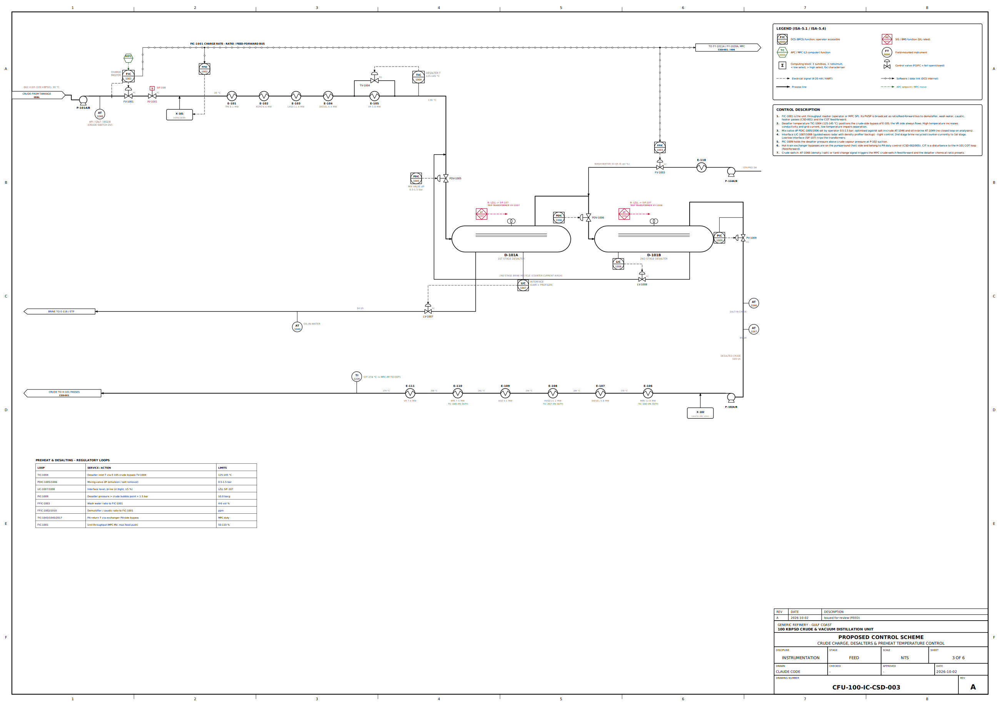
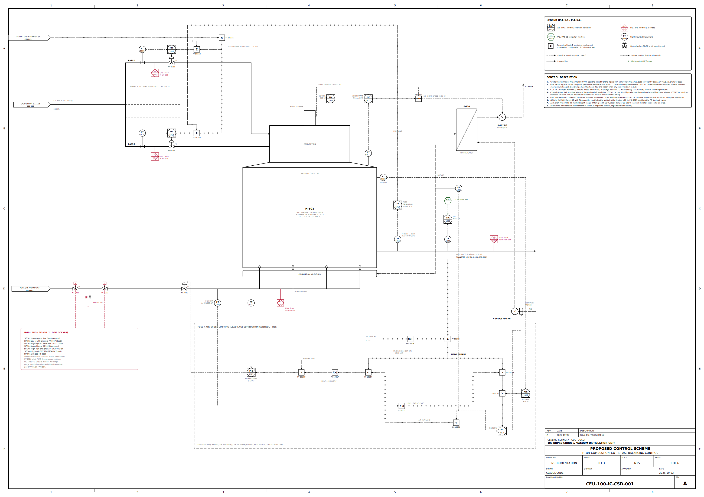
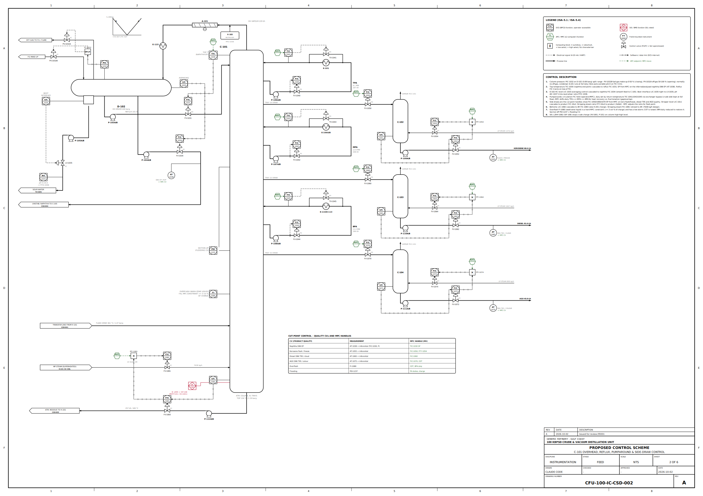
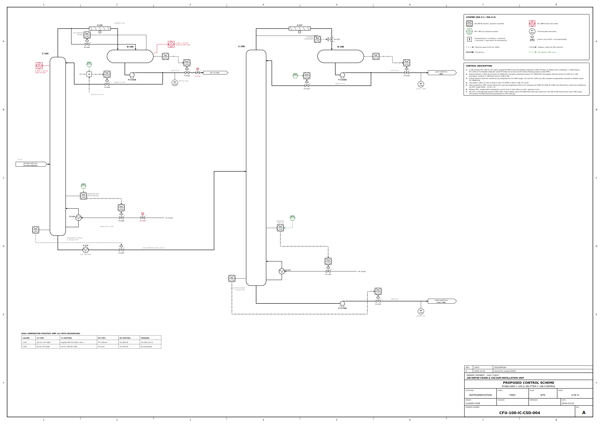
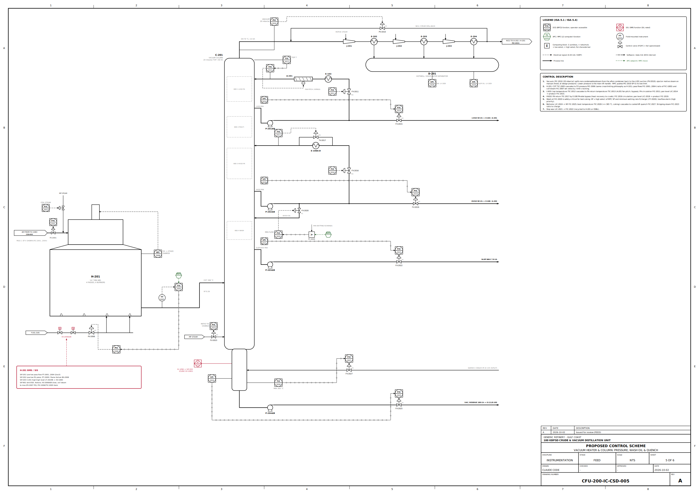
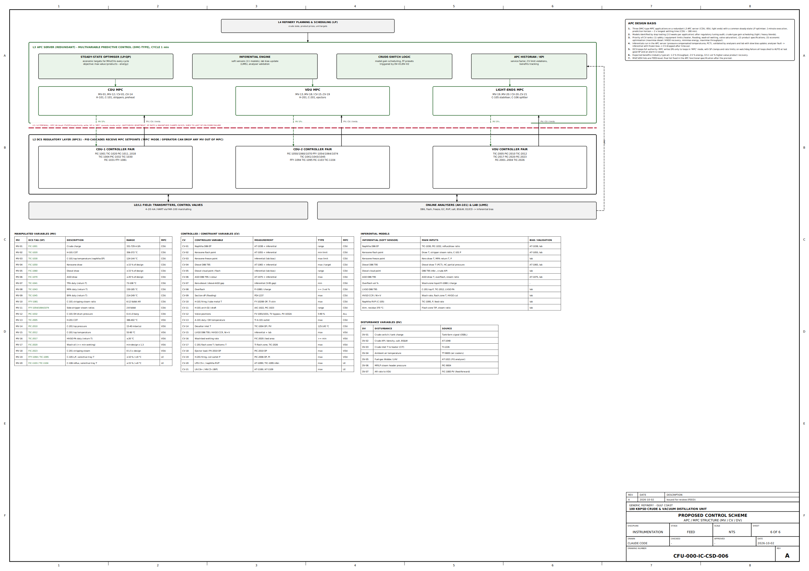
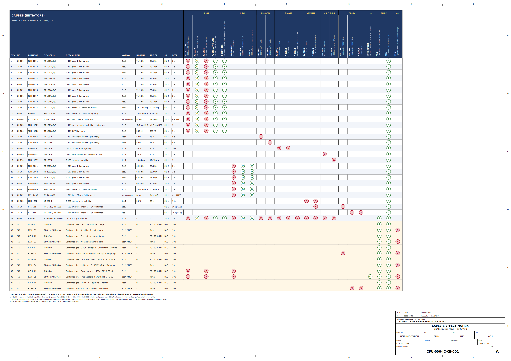
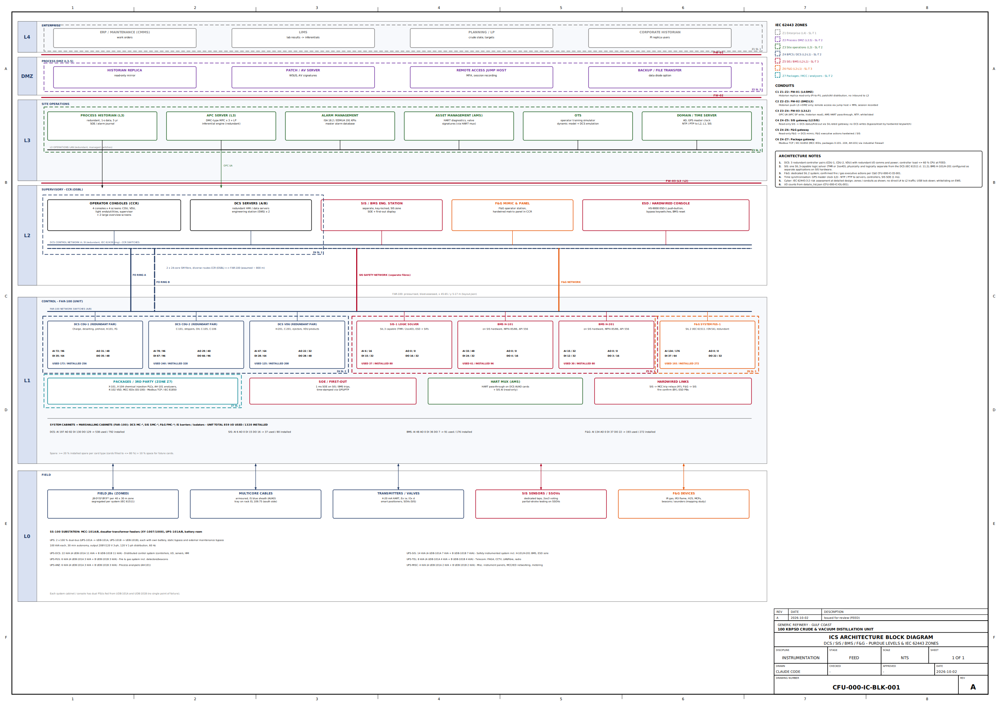
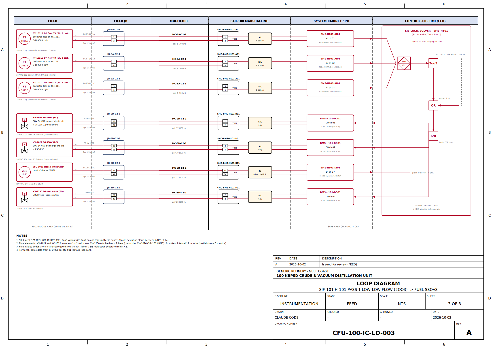

# 1. Introduction and scope

This document defines the control philosophy and the proposed control scheme for the 100 kBPSD Crude & Vacuum Distillation Unit (design throughput 100,000 BPSD of Arab Light (design), turndown 50 %). It covers the regulatory (BPCS / DCS) layer, the advanced process control (APC / MPC) layer, alarm management, the safety layer interfaces (SIS, BMS, F&G - detailed in CFU-000-IC-RPT-002 and CFU-000-IC-CE-001), the ICS architecture and the instrument design criteria, including control valve sizing for the key valves.

All tags follow ISA-5.1 and are taken from the master loop list `cfu/control_loops.py` (data/control_loops.json) and the instrument index CFU-000-IC-IDX-001 (data/instruments.json). Tags introduced by I&C (analysers, computing blocks) are listed in section 13 for inclusion in the index.

**Related deliverables**

| Document | Title |
|---|---|
| CFU-100-IC-CSD-001..005, CFU-000-IC-CSD-006 | Proposed control scheme diagrams (A1) |
| CFU-000-IC-BLK-001 | ICS architecture block diagram (A1) |
| CFU-000-IC-CE-001 | Cause & effect matrix (xlsx + A1 drawing) |
| CFU-000-IC-RPT-002 | SIF list and SIL determination (LOPA) |
| CFU-000-IC-IOL-001 | I/O list (xlsx), data/io_list.json |
| CFU-000-IC-CAL-001 | Control valve sizing (xlsx, summarised in section 12) |
| CFU-100-IC-LD-001..003 | Typical loop diagrams (A3) |
| CFU-xxx-PR-PFD / PID | Process flow diagrams / P&IDs (process discipline) |

**Codes and standards:** ISA-5.1, ISA-5.4, ISA-18.2 / IEC 62682, EEMUA 191, ISA-75.01.01 / IEC 60534, IEC 61511 / ISA-84, IEC 62443, API 551, API 552, API 554, API 556, NFPA 85/86, IEC 60079.

# 2. Control objectives

- **Safety and environment** - keep the unit within its safe operating envelope; independent protection layers (SIS / BMS / F&G) separate from the BPCS; no single failure leads to an unsafe state.

- **Product quality** - hold naphtha end point, kerosene flash / freeze, diesel T95 / cloud, AGO and VGO quality and LPG / naphtha RVP within specification with minimum give-away.

- **Throughput** - maximise crude charge up to the active constraint (heater firing, flooding, overhead condenser, vacuum system, pump / valve limits).

- **Energy** - maximise preheat recovery (CIT), minimise excess O2, stripping steam and reflux.

- **Stability and operability** - smooth feed to downstream units (averaging level control), fast crude switches, robust start-up / shutdown and 50 % turndown.

- **Reliability** - redundant controllers, I/O isolation per area, dual-fed power, no common-mode with the SIS.

The control hierarchy is: L0/L1 field and regulatory PID (DCS), L2 operator HMI and supervisory logic, L3 multivariable predictive control with inferentials and an economic LP; the SIS / BMS / F&G act independently of all of these.

**Key operating values (design case, data/process_results.json)**

| Item | Value | Item | Value |
|---|---|---|---|
| Crude charge | 662 m3/h std (570 t/h) | Desalter temperature | 136 °C |
| CIT (H-101 inlet) | 274 °C | H-101 COT | 366 °C |
| H-101 absorbed / fired | 60.7 / 67.4 MW | H-101 passes / burners | 8 / 16 |
| C-101 top T / P | 134 °C / 1.19 barg | D-102 pressure | 0.69 barg |
| Flash zone T / P | 361 °C / 1.47 barg | Reflux | 101 t/h |
| TPA / MPA / BPA duty | 8.1 / 12.8 / 12.4 MW | Kero / diesel / AGO draw T | 220 / 302 / 343 °C |
| H-201 COT | 398 °C | C-201 top / flash zone | 20 / 60 mbar(a) |
| LVGO / HVGO PA duty | 9.0 / 13.6 MW | C-201 bottoms T | 366 °C (limit 365 °C) |
| C-105 top P | 11.8 bar(a) | C-106 top P | 2.1 bar(a) |

# 3. Regulatory control strategy

General rules applied to all sections:

- Flow loops are the innermost loops for all manipulated streams (cascade slaves); valves are never positioned directly by quality or temperature controllers.

- Product draws from towers are on flow control; accumulator / bottoms levels cascade to the downstream flow (material balance 'in the direction of flow' except where noted).

- Pumparound duties are controlled by return temperature via exchanger bypass on the pumparound side, with circulation rate on flow control.

- Ratio stations (FFIC / FFY) relate chemical injection, wash water and stripping steam to their master flows; ratios are operator / MPC set.

- Selectors and cross-limits are implemented in the DCS with anti-windup (external reset feedback).

- All cascades are bumpless; on slave failure or bad PV the master goes to tracking.

## 3.1 Crude charge and desalting (CFU-100-IC-CSD-003)

- **Throughput** - FIC-1001 on P-101 discharge (FV-1001) is the unit throughput master (662 m3/h design). Its SP is set by the operator or the CDU MPC (max-feed push). The PV / SP is broadcast on a ratio / feed-forward bus to: demulsifier FFIC-1002 (X-101 stroke), wash water FFIC-1003 (5 vol %), caustic FFIC-1010 (X-102), the H-101 pass flow controllers and the COT feed-forward.

- **Desalter temperature** - TIC-1004 positions TV-1004 on the crude-side bypass of E-105 (VR side always flowing) to hold 136 °C (limits 125-145 °C).

- **Mixing** - PDIC-1005 / 1006 hold the mix-valve dP (0.5-1.5 bar) for wash-water dispersion; the SP is optimised against salt-in-crude AT-1046 and oil-in-brine AT-1049 (operator, not closed loop).

- **Interface** - LIC-1007 / 1008 (guided-wave radar + density profiler) control the water/oil interface tightly via brine valves LV-1007 / LV-1008; second-stage brine is recycled counter-currently to stage 1. Low-low interface (SIF-107) trips the transformers.

- **Pressure** - PIC-1009 holds the desalter outlet pressure (10.0 barg) above crude vapour pressure at the booster pump P-102 suction.

## 3.2 Preheat train

The cold train (E-101..E-105) heats crude from 30 °C to the desalter; the hot train (E-106..E-111) to a CIT of 274 °C. Exchanger bypasses that carry a control function are on the hot (pumparound) side and belong to the pumparound duty loops: TIC-1043 (MPA, E-106), TIC-1045 (BPA, E-110 / E-113) and TIC-2017 (HVGO, E-108). This keeps the crude flow path simple and makes CIT a measured disturbance (TI-1226) fed forward to the COT controller. The MPC trades heat recovery (higher CIT) against column fractionation through the PA duties.

## 3.3 Atmospheric heater H-101 (CFU-100-IC-CSD-001)

- **Pass flow** - each of the 8 passes has a flow controller FIC-1011..1018. The base SP of each pass = FIC-1001 / 8 (FY-1011A, 71.1 t/h).

- **Pass balancing** - TDIC-1019 compares the pass outlet temperatures TI-1011..1018 with their average and computes biases FY-1011B..1018B; the biases are normalised so that their sum is zero, i.e. **total flow is held constant** and only the distribution changes. Biases are clamped to ±10 % of pass flow and frozen when any pass FIC is not in cascade or a pass flow is near its low-low trip.

- **COT** - TIC-1020 (SP from MPC) is the master. A feed-forward FY-1020A = f(charge x (COT - CIT)) with lead-lag dynamic compensation is added (FY-1020B) to give the firing demand.

- **Cross-limiting (lead-lag) combustion control** - fuel SP = MIN(firing demand, air available / stoichiometric ratio) (FY-1021A); air SP = MAX(firing demand, actual fuel heat release) x air/fuel ratio x O2 trim (FY-1025A / B). On a load increase the air leads and fuel follows; on a decrease the fuel leads and air follows, so the firebox never becomes sub-stoichiometric. Actual fuel heat release uses FG flow FT-1021 corrected by the Wobbe analyser AT-1021.

- **Fuel** - the fuel heat demand is characterised to a burner pressure SP (burner curve, FY / PY-1021A); a min-fire stop (high select PY-1021B) keeps burners above the stable minimum. PIC-1021 manipulates PV-1021. (The loop list describes this as 'low select vs min-fire'; the implementation is a high select against the minimum burner pressure combined with the cross-limit low select.)

- **O2 trim** - AIC-1022 (arch O2, typical SP 2-3 % wet, with CO override > 200 ppm) multiplies the air/fuel ratio, limited ±10 %. Combustion air FIC-1025 positions the FD fan inlet vanes (K-101A/B).

- **Draft** - PIC-1023 holds -2.5 mmH2O at the arch; split range via PY-1023: ID fan speed (K-102A/B VSD) 0-50 %, stack damper 50-100 %. On ID fan trip the damper opens for natural-draft operation at reduced firing.

- **Stripping steam superheat** - TIC-1024 (350 °C) on the convection steam coil desuperheater.

## 3.4 Atmospheric column C-101 and side strippers (CFU-100-IC-CSD-002)

- **Column pressure (split range)** - PIC-1032 on D-102 (0.69 barg): 0-50 % output closes the fuel-gas make-up PV-1032B, 50-100 % opens the off-gas valve PV-1032A to FG / flare. Normally the overhead is a total condenser and neither valve passes significant flow. The MPC may lower the PIC SP to improve lift, constrained by A-101 duty and the reflux drum temperature.

- **Top temperature -> reflux cascade** - TIC-1030 (top 134 °C, pressure-compensated) sets the SP of reflux FIC-1031 (101 t/h). TIC-1030 is the naphtha end-point handle for the MPC (CV: AT-1038 / inferential).

- **Overhead accumulator** - LIC-1033 (averaging) -> naphtha FIC-1034 (feed to C-105); boot interface LIC-1035 tight to LV-1035; pH AIC-1037 trims the neutraliser ratio FFIC-1036 (X-103).

- **Pumparound duty** - FIC-1040 / 1042 / 1044 hold circulation; TIC-1041 / 1043 / 1045 set the return temperature, i.e. the duty, via PA-side exchanger bypass (TV-1041, TV-1043, TV-1045). Duty distribution TPA / MPA / BPA is an MPC degree of freedom (heat recovery vs. internal reflux in the fractionation zones).

- **Side-draw cut-point control** - draw flows FIC-1050 / 1060 / 1070 are the cut-point handles; their SPs come from the MPC (kero flash / freeze, diesel T95, AGO T95). The internal reflux below each draw must stay above a minimum (inferred from the column heat balance - MPC constraint).

- **Strippers** - bottoms level LIC-1051 / 1061 / 1071 cascades to product flow FIC-1052 / 1062 / 1072. Stripping steam FIC-1054 / 1064 / 1074 is ratioed to the product flow (FFY, lb/bbl) - the MPC adjusts the ratio for flash point.

- **Bottoms** - LIC-1082 cascades to the atmospheric residue flow FIC-1083 (also the H-201 charge). Bottom stripping steam FIC-1081 is ratioed to AR (7638 kg/h design, ~10 lb/bbl).

- **Overflash** - FI-1080 (wash-zone liquid) is monitored as % of charge with a low alarm; it is a hard MPC constraint (>= 3 vol %) raised by COT or by reducing BPA duty. Section dP PDI-1237 is the flooding indicator.

## 3.5 Stabiliser C-105 and splitter C-106 (CFU-100-IC-CSD-004)

- **Pressure** - C-105: PIC-1091 hot-vapour bypass PV-1091 around the flooded condenser A-106 (11.8 bar(a)). C-106: PIC-1100 on the flooded-condenser outlet PV-1100 (2.1 bar(a)); floating-pressure operation under MPC.

- **Material balance** - D-105 / D-106 levels LIC-1092 / 1101 cascade to LPG FIC-1093 / LN FIC-1102; C-105 bottoms LIC-1097 to LV-1097 (C-106 feed, averaging); C-106 bottoms LIC-1106 to HN FIC-1107.

- **Energy balance** - sensitive-tray temperatures TIC-1095 (C-105) and TIC-1104 (C-106, tray 30), pressure-compensated, cascade to reboiler steam FIC-1096 (HP steam, E-116) and FIC-1105 (MP steam, E-117). Reflux: FIC-1094 on ratio to feed (FFY-1094) for C-105; FIC-1103 on flow for C-106.

- **Dual-composition strategy** - top composition (LPG C5+, LN C6+) is controlled with reflux (L/F), bottom composition (naphtha RVP, HN C5- / IBP) with the sensitive-tray temperature SP. The interaction (L-V configuration, RGA ~ 2-4) is handled by the light-ends MPC using GC analysers AT-1099, AT-1108 and AT-1109. Without MPC the columns run single-ended (tray temperature) with reflux on ratio and operator trim.

## 3.6 Vacuum unit H-201 / C-201 (CFU-200-IC-CSD-005)

- **H-201** - pass flows FIC-2001..2004 (ratio of FIC-1083), coil (velocity) steam FIC-2007, COT TIC-2005 (398 °C) cascaded to FG pressure PIC-2006 with the same cross-limiting and FF philosophy as H-101; O2 AIC-2008 on the stack damper (natural draft).

- **Vacuum pressure** - PIC-2010 (20 mbar(a)) recycles off-gas / steam from the after-condenser to the 1st-stage ejector J-201 suction (PV-2010). Motive steam is not throttled. The MPC pushes the pressure SP to the lowest achievable value (max lift), constrained by PV-2010 output.

- **LVGO section** - top temperature TIC-2012 cascades to the LVGO PA return temperature TIC-2013 (A-201 fan pitch / bypass); PA circulation FIC-2011; pan level LIC-2014 -> product FIC-2015.

- **HVGO section** - FIC-2016 circulation, TIC-2017 PA return temperature by E-108 PA-side bypass; pan level LIC-2018 -> HVGO product FIC-2019.

- **Wash oil (minimum flow)** - FIC-2020 SP = high select (FY-2020) of the MPC SP and a minimum wetting rate f(charge), protecting the wash bed against coking. Low-flow alarm is high priority.

- **Bottoms and quench** - LIC-2024 -> VR FIC-2025; boot temperature TIC-2026 (max 365 °C) cascades to the cooled-VR quench FIC-2027. Stripping steam FIC-2023 is ratioed to charge. Slop wax LIC-2021 -> FIC-2022.

## 3.7 Unit utilities

Fuel-gas header pressure PIC-9001 (D-103) with KO drum level LIC-9002; flare KO drum D-104 level LIC-9003 (pump-out P-119A/B start/stop); LP steam header PIC-9004 (let-down). Steam generators E-113 / E-201 use three-element level control (LIC-1110 / 2030: level + steam flow FF + BFW flow) with steam pressure PIC-1111 / let-down.

\pagebreak

# 4. Level control tuning philosophy

Levels are classified as **averaging** (use the vessel hold-up to filter flow disturbances to the downstream unit - level allowed to swing between 25 % and 75 %) or **tight** (level itself matters: interfaces, draw pans, steam drums, seals). Surge time is the volume between 25 % and 75 % of span divided by the outflow. Averaging PI tuning: Kc 0.5-1.0 %/% and integral time ~ 4 x surge time (critically damped response to a step in inflow, level stays within the band); tight control: Kc 2-4 %/%, short integral. Error-squared or gap action is not used (non-linear behaviour hinders MPC identification).

| Loop | Service | Vol. 25-75 % m3 | Outflow m3/h | Surge min | Mode | Manipulates | Tuning guide |
|---|---|---|---|---|---|---|---|
| LIC-1033 | D-102 HC level | 66.4 | 165 | 24.2 | Averaging | FIC-1034 (C-105 feed) | PI: Kc 0.5-1.0 %/%, Ti ~ 97 min |
| LIC-1092 | D-105 level | 7.6 | 12 | 37.1 | Averaging | FIC-1093 (LPG) | PI: Kc 0.5-1.0 %/%, Ti ~ 148 min |
| LIC-1101 | D-106 level | 29.6 | 41 | 43.3 | Averaging | FIC-1102 (LN) | PI: Kc 0.5-1.0 %/%, Ti ~ 173 min |
| LIC-1082 | C-101 bottom (2.0 m span) | 19.2 | 365 | 3.2 | Averaging | FIC-1083 (H-201 charge) | PI: Kc 0.5-1.0 %/%, Ti ~ 13 min |
| LIC-1051 | C-102 bottom (1.5 m span) | 3.4 | 111 | 1.8 | Averaging | FIC-1052 | PI: Kc 0.5-1.0 %/%, Ti ~ 7 min |
| LIC-1061 | C-103 bottom (1.5 m span) | 4.3 | 131 | 1.9 | Averaging | FIC-1062 | PI: Kc 0.5-1.0 %/%, Ti ~ 8 min |
| LIC-1071 | C-104 bottom (1.5 m span) | 2.3 | 74 | 1.9 | Averaging | FIC-1072 | PI: Kc 0.5-1.0 %/%, Ti ~ 8 min |
| LIC-1097 | C-105 bottom (1.5 m span) | 5.2 | 196 | 1.6 | Averaging | LV-1097 (C-106 feed) | PI: Kc 0.5-1.0 %/%, Ti ~ 6 min |
| LIC-1106 | C-106 bottom (1.5 m span) | 11.3 | 140 | 4.9 | Averaging | FIC-1107 (HN) | PI: Kc 0.5-1.0 %/%, Ti ~ 19 min |
| LIC-2024 | C-201 boot (2.0 m span) | 14.1 | 138 | 6.1 | Tight-ish (residence time limit, coking) | FIC-2025 (VR) | PI: Kc 1.5-2, Ti 5-8 min; TIC-2026 quench limits T |
| LIC-1007 / 1008 | Desalter interface | - | 36 | - | Tight | LV-1007 / LV-1008 | PI: Kc 2-3, Ti 3-5 min (grid protection) |
| LIC-1035 | D-102 boot interface | - | 13 | - | Tight | LV-1035 | PI: Kc 2-4, Ti 2-4 min |
| LIC-2014 / 2018 / 2021 | C-201 draw-pan levels | small | - | < 2 | Tight | product FICs | PI: Kc 2-4, Ti 1-3 min (pans run dry fast) |
| LIC-1110 / 2030 | E-113 / E-201 steam drum | - | - | - | 3-element | LV BFW | Level + steam flow FF + BFW flow cascade |
| LIC-1098 | E-116 condensate pot | small | - | - | Tight | LV-1098 | PI: Kc 2-3, Ti 2 min |
| LIC-2028 / 2029 | D-201 hotwell water / slop | - | - | - | Tight (barometric seal) | LV-2028/2029 | PI: Kc 2, Ti 3 min |

# 5. Alarm philosophy (ISA-18.2 / IEC 62682)

Alarm management follows the ISA-18.2 life cycle: philosophy -> identification -> rationalisation -> detailed design -> implementation -> operation -> maintenance -> monitoring & assessment -> MOC -> audit. Every alarm must indicate an abnormal condition requiring a timely operator action; status and information go to the journal, not the alarm list. Rationalisation is done in a workshop (process, operations, I&C) and recorded in the master alarm database (L3 alarm management server).

| Priority | Consequence if no action | Time to respond | Target share | Annunciation |
|---|---|---|---|---|
| Emergency (1) | Safety / environment / major damage (pre-trip) | < 5 min | ~ 5 % | Red, audible tone 1, cannot be shelved |
| High (2) | Off-spec, equipment damage, unit upset | 5-15 min | ~ 15 % | Orange, tone 2 |
| Low (3) | Minor efficiency / quality loss | 15-30 min | ~ 80 % | Yellow, tone 3 |
| Journal | Status, diagnostics, events | - | - | Event journal only |

- **Performance targets (EEMUA 191)**: average alarm rate <= 1 per 10 min per console in steady operation; peak <= 10 alarms in 10 min after an upset; < 1 % of time in flood; no stale alarms > 24 h; no chattering (> 3 per minute).

- **Design rules**: deadbands and on/off delays per signal type (flow 2 %, 5 s; level 2 %, 10 s; pressure 1 %, 5 s; temperature 1 °C, 15 s); SIS pre-trip alarms 5-10 % ahead of trip set point; deviation alarms for cascades only where the slave can saturate.

- **State-based alarming**: alarm sets switch with operating mode (start-up, normal, turndown, crude switch, shutdown) and with equipment status (spare pump, heater out of service).

- **Suppression and shelving**: designed suppression for consequential alarms after a trip (first-out kept); shelving time-limited (max 8 h) with shift-log review; emergency priority cannot be shelved.

- **SIS alarms**: SIS trips and first-out are displayed via the read-only SIS-DCS gateway; SIS bypasses and transmitter deviations alarm in the CCR.

- **KPIs**: monthly report from the alarm management server (top-10 bad actors, standing, chattering, flood periods), reviewed by operations.

\pagebreak

# 6. Advanced process control (APC / MPC)

Three DMC-type multivariable predictive controllers run on a redundant L3 APC server with a common steady-state LP / QP optimiser: CDU (H-101, C-101, strippers, preheat), VDU (H-201, C-201, ejectors) and light ends (C-105, C-106). Execution 1 min; models from plant step tests after a regulatory tuning audit; crude-type gain scheduling for light / heavy blends. The MPC writes setpoints only to DCS loops in 'MPC' cascade mode with SP clamps and rate limits; a watchdog sheds all loops to AUTO at the last SP on loss of communication.

## 6.1 Manipulated variables

| MV | DCS tag (SP) | Description | Range | MPC |
|---|---|---|---|---|
| MV-01 | FIC-1001 | Crude charge | 331-729 m3/h | CDU |
| MV-02 | TIC-1020 | H-101 COT | 356-372 °C | CDU |
| MV-03 | TIC-1030 | C-101 top temperature (naphtha EP) | 124-144 °C | CDU |
| MV-04 | FIC-1050 | Kerosene draw | ±15 % of design | CDU |
| MV-05 | FIC-1060 | Diesel draw | ±15 % of design | CDU |
| MV-06 | FIC-1070 | AGO draw | ±20 % of design | CDU |
| MV-07 | TIC-1041 | TPA duty (return T) | 73-108 °C | CDU |
| MV-08 | TIC-1043 | MPA duty (return T) | 150-185 °C | CDU |
| MV-09 | TIC-1045 | BPA duty (return T) | 214-249 °C | CDU |
| MV-10 | FFY-1081 | C-101 stripping steam ratio | 6-12 lb/bbl AR | CDU |
| MV-11 | FFY-1054/1064/1074 | Side-stripper steam ratios | 2-8 lb/bbl | CDU |
| MV-12 | PIC-1032 | C-101 OH drum pressure | 0.4-1.0 barg | CDU |
| MV-13 | TIC-2005 | H-201 COT | 386-402 °C | VDU |
| MV-14 | PIC-2010 | C-201 top pressure | 15-40 mbar(a) | VDU |
| MV-15 | TIC-2012 | C-201 top temperature | 55-90 °C | VDU |
| MV-16 | TIC-2017 | HVGO PA duty (return T) | ±20 °C | VDU |
| MV-17 | FIC-2020 | Wash oil (>= min wetting) | min-design x 1.3 | VDU |
| MV-18 | FIC-2023 | C-201 stripping steam | 0-1.5 x design | VDU |
| MV-19 | FFY-1094 / TIC-1095 | C-105 L/F, sensitive tray T | ±10 % / ±8 °C | LE |
| MV-20 | FIC-1103 / TIC-1104 | C-106 reflux, sensitive tray T | ±15 % / ±8 °C | LE |

## 6.2 Controlled and constraint variables

| CV | Variable | Measurement | Type | MPC |
|---|---|---|---|---|
| CV-01 | Naphtha D86 EP | AT-1038 + inferential | range | CDU |
| CV-02 | Kerosene flash point | AT-1055 + inferential | min limit | CDU |
| CV-03 | Kerosene freeze point | inferential (lab bias) | max limit | CDU |
| CV-04 | Diesel D86 T95 | AT-1065 + inferential | max / target | CDU |
| CV-05 | Diesel cloud point / flash | inferential (lab bias) | range | CDU |
| CV-06 | AGO D86 T95 / colour | AT-1075 + inferential | max | CDU |
| CV-07 | Kero-diesel / diesel-AGO gap | inferential (5-95 gap) | min | CDU |
| CV-08 | Overflash | FI-1080 / charge | >= 3 vol % | CDU |
| CV-09 | Section dP (flooding) | PDI-1237 | max | CDU |
| CV-10 | H-101 firing / tube metal T | FY-1020B OP, TI skin | max | CDU |
| CV-11 | H-101 arch O2 / draft | AIC-1022, PIC-1023 | range | CDU |
| CV-12 | Valve positions | FV-1001/1031, TV bypass, PV-1032A | 5-90 % | ALL |
| CV-13 | A-101 duty / OH temperature | TI A-101 outlet | max | CDU |
| CV-14 | Desalter inlet T | TIC-1004 OP / PV | 125-145 °C | CDU |
| CV-15 | LVGO D86 T95 / HVGO CCR, Ni+V | inferential + lab | max | VDU |
| CV-16 | Wash-bed wetting rate | FIC-2020 / bed area | >= min | VDU |
| CV-17 | C-201 flash zone T / bottoms T | TI flash zone, TIC-2026 | max | VDU |
| CV-18 | Ejector load / PV-2010 OP | PIC-2010 OP | max | VDU |
| CV-19 | H-201 firing, coil outlet P | PIC-2006 OP, PI | max | VDU |
| CV-20 | LPG C5+ / naphtha RVP | AT-1099 / TIC-1095 infer. | max | LE |
| CV-21 | LN C6+ / HN C5- (IBP) | AT-1108 / AT-1109 | max | LE |

## 6.3 Disturbance variables

| DV | Disturbance | Source |
|---|---|---|
| DV-01 | Crude switch / tank change | Tank-farm signal (OSBL) |
| DV-02 | Crude API / density, salt, BS&W | AT-1048 |
| DV-03 | Crude inlet T to heater (CIT) | TI-1226 |
| DV-04 | Ambient air temperature | TT-9005 (air coolers) |
| DV-05 | Fuel-gas Wobbe / LHV | AT-1021 (FG analyser) |
| DV-06 | MP/LP steam header pressure | PIC-9004 |
| DV-07 | AR rate to VDU | FIC-1083 PV (feed-forward) |

## 6.4 Inferential models (soft sensors)

Inferentials are linear / PLS models on pressure-compensated temperatures (PCT), flows and heat-balance terms, executed in the APC server and validated by online analysers (fast bias) and laboratory results (slow bias via LIMS). On analyser failure the inferential continues with frozen bias; after a time-out the CV is dropped from the MPC.

| Inferential | Main inputs | Bias / validation |
|---|---|---|
| Naphtha D86 EP | TIC-1030, PIC-1032, reflux/draw ratio | AT-1038, lab |
| Kerosene flash point | Draw T, stripper steam ratio, C-101 P | AT-1055, lab |
| Kerosene freeze point | Kero draw T, MPA return T, P | lab |
| Diesel D86 T95 | Diesel draw T (PCT), HC partial pressure | AT-1065, lab |
| Diesel cloud point | D86 T95 infer., crude API | lab |
| AGO D86 T95 | AGO draw T, overflash, steam ratio | AT-1075, lab |
| Overflash vol % | Wash-zone liquid FI-1080 / charge | - |
| LVGO D86 T95 | C-201 top P, TIC-2012, LVGO PA | lab |
| HVGO CCR / Ni+V | Wash rate, flash zone T, HVGO cut | lab |
| Naphtha RVP (C-105) | TIC-1095, P, feed rate | lab |
| Atm. residue 370 °C- | Flash zone T/P, steam ratio | lab |

## 6.5 Online analysers

Analysers are housed in the analyser house AH-101 (UPS-fed, HVAC, gas detection) close to the sample points; fast-loop sample systems with return to process; validation by automatic line sample and lab correlation.

| Tag | Service | Type | Cycle | Use |
|---|---|---|---|---|
| AT-1022 / AT-2008 | H-101 / H-201 flue gas O2 + CO | In-situ zirconia O2 + TDL CO (arch) | continuous | O2 trim, CO override, CV |
| AT-1037 | D-102 boot sour water pH | pH probe (retractable) | continuous | Neutraliser trim |
| AT-1038 | Unstab. naphtha D86 EP / RVP | Online distillation (ASTM D86 equiv.), AH-101 | 10-15 min | MPC CV-01, inferential bias |
| AT-1046 | Desalted crude salt content | Online salt-in-crude (conductometric) | 15 min | Desalter optimisation |
| AT-1047 | Desalted crude BS&W | Microwave water-cut | continuous | Desalter performance |
| AT-1048 | Charge crude API / salt / BS&W | Densitometer + salt + water-cut | continuous | Crude-switch DV (MPC) |
| AT-1049 | Desalter brine oil-in-water | UV fluorescence | continuous | Brine quality / ETP |
| AT-1055 | Kerosene flash / freeze point | Online flash (Pensky-Martens eq.) + freeze analyser | 10-20 min | MPC CV-02/03 |
| AT-1065 | Diesel D86 T95 / cloud point | Online distillation + cloud point | 15 min | MPC CV-04/05 |
| AT-1075 | AGO D86 T95 / colour | Online distillation + colorimeter | 15 min | MPC CV-06 |
| AT-1099 | LPG C5+ | Process GC | 5 min | C-105 MPC CV |
| AT-1108 / AT-1109 | LN C6+ & RVP / HN IBP & C5- | Process GC (shared, stream switching) | 6 min | C-106 MPC CVs |
| AT-1021 | Fuel gas Wobbe index / LHV | Fast calorimeter | < 30 s | Combustion FF, DV-05 |
| AT-2032 | Vacuum off-gas H2S | UV / lead-acetate tape analyser | 2 min | H-201 firing / SO2 |

# 7. Start-up, shutdown, crude switch and turndown

## 7.1 Start-up

- Cold circulation (crude through preheat, H-101 coils and C-101 bottoms back to slop) on flow control with level loops in AUTO; heater passes on FIC with SIF-101 armed (permissive: all pass flows > LL + margin).

- H-101 / H-201 light-off by BMS sequence: purge (5 volume changes, air flow >= 25 %), pilot ignition with proof, main burners one by one; FG pressure on PIC-1021 in AUTO at minimum fire, COT ramp limited to 50 °C/h by TIC-1020 SP ramp.

- Column pressure on PIC-1032 using FG make-up (PV-1032B); reflux established on FIC-1031 manual flow, TIC-1030 into cascade when the top temperature is meaningful; PAs started top to bottom on FIC with TICs in manual until duties stabilise.

- Side draws opened on FIC at low rate once trays are wet; stripping steam on ratio after product flow established; VDU started when AR quality is stable (vacuum pulled on ejectors with steam, PIC-2010 into AUTO; wash oil FIC-2020 established before H-201 COT exceeds 370 °C).

- MPC applications switched on after > 4 h of stable regulatory operation.

## 7.2 Normal shutdown

Reverse sequence with ramped SPs: MPC off, COT reduced to 300 °C (50 °C/h), draws closed progressively, heaters to minimum fire then burners out by BMS, circulation maintained until heater outlet < 200 °C, coil steam-out. Emergency shutdown is by SIS (ESD-1, SIF-901) per the C&E matrix.

## 7.3 Crude switch strategy

- Tank change signal (DV-01) and charge density AT-1048 (DV-02) trigger the crude-switch logic in the APC server: model gain set selected for the new crude, cut-point SPs pre-moved by the feed-forward, desalter chemical / wash ratios preset.

- COT and side-draw rates are moved with feed-forward on the measured density change; inferential bias updates are frozen for 2 h (analysers and lab confirm the new steady state).

- Regulatory layer: blending of tanks over ~30 min (OSBL) is preferred to a step change; FIC-1001 rate cut of 5-10 % during the switch is an operator option.

## 7.4 Turndown to 50 %

- H-101 / H-201 pass flow LL trips are set at 40 % of design pass flow, below the 50 % turndown, so the heaters can operate at turndown with margin; burners operate at ~ 45-50 % fire (turndown 3:1 burners).

- Control valves at 0.5 x normal flow: travel 25-67 % (all >= 10 %, section 12).

- Orifice flow meters: at 50 % flow the dP is 25 % of span (rangeability 3:1 acceptable); pass flow and SIS flow transmitters are ranged so that the LL trip is above 20 % of span.

- Column internals: tray weeping limits the vapour rate to ~ 50-60 % of design; at turndown the stripping steam and pumparound ratios are kept, and the MPC keeps overflash and internal reflux minima.

- Pumps: minimum continuous flow by recirculation (P&ID); pumparound flows are kept above 60 % of design to keep exchangers in turbulent flow.

\pagebreak

# 8. Safety instrumented systems (summary)

The SIFs below are implemented in the SIS (SIL 3-capable logic solver, separate from the DCS). Heater BMS functions run as separate applications on SIS hardware. SIL determination by LOPA is in CFU-000-IC-RPT-002; the cause & effect matrix is CFU-000-IC-CE-001.

| SIF | Function | Initiators | Final elements | SIL (SRS) | LOPA RRF | LOPA SIL |
|---|---|---|---|---|---|---|
| SIF-101 | H-101 low-low pass flow (any pass) -> trip fuel | FT-1011..1018 (2oo3 each pass) | XV-1021/1022 FG SSOV, XV-1026 pilot | SIL 2 | 250 | SIL 2 |
| SIF-102 | H-101 low-low fuel gas pressure -> trip fuel | PT-1027A/B/C 2oo3 | XV-1021/1022 | SIL 1 | 25 | SIL 1 |
| SIF-103 | H-101 high-high fuel gas pressure -> trip fuel | PT-1027A/B/C 2oo3 | XV-1021/1022 | SIL 1 | 25 | SIL 1 |
| SIF-104 | H-101 loss of flame (all burners) -> trip fuel | BS-1028 (scanners) | XV-1021/1022/1026 | SIL 2 | 125 | SIL 2 |
| SIF-105 | H-101 high-high arch pressure / loss of ID fan -> trip | PT-1029A/B/C | XV-1021/1022 | SIL 1 | 20 | SIL 1 |
| SIF-106 | H-101 high-high COT -> trip fuel | TT-1020A/B/C 2oo3 | XV-1021/1022 | SIL 1 | 50 | SIL 1 |
| SIF-107 | D-101A/B low-low interface (grid short) -> trip transformers | LT-1007B / LT-1008B | Desalter transformer CB | SIL 1 | 30 | SIL 1 |
| SIF-108 | C-101 high-high bottom level -> stop P-101 / close FV-1001 | LT-1082B | XV-1001 + P-101 trip | SIL 1 | 50 | SIL 1 |
| SIF-109 | D-105 low-low level -> close LPG product XV (gas blow-by to LPG treating) | LT-1092B | XV-1093 | SIL 1 | 30 | SIL 1 |
| SIF-110 | C-105 high-high pressure -> cut reboiler steam | PT-1091B | XV-1096 | SIL 1 | 20 | SIL 1 |
| SIF-201 | H-201 low-low pass flow -> trip fuel | FT-2001..2004 | XV-2006A/B | SIL 2 | 250 | SIL 2 |
| SIF-202 | H-201 low-low FG pressure / flame failure -> trip | PT-2009A/B/C, BS-2008 | XV-2006A/B | SIL 1 | 25 | SIL 1 |
| SIF-203 | C-201 high-high bottom level -> trip FV-1083 / P-112 | LT-2024B | XV-1083 | SIL 1 | 50 | SIL 1 |
| SIF-204 | Pump P-112/P-204 hot-pump emergency isolation (fire) | Manual HS / fire detection | EIV-1121/EIV-2041 (ROSOV) | SIL 1 | 50 | SIL 1 |
| SIF-901 | Unit emergency shutdown (ESD-1, manual) | HS-9000 (CCR + field) | All unit trip valves, heater trips | SIL 2 | - | SIL 2 (company standard, manual ESD - LOPA n/a) |

# 9. ICS architecture

The ICS follows the Purdue / ISA-95 model with a process DMZ (CFU-000-IC-BLK-001). The DCS has three redundant controller pairs in the field auxiliary room FAR-100 (CDU-1: charge, desalting, preheat, H-101, fuel gas; CDU-2: C-101, strippers, overhead, C-105, C-106; VDU: H-201, C-201, ejectors). The SIS logic solver (SIL 3 capable), the BMS applications and the F&G system are physically separate. Marshalling and system cabinets are in FAR-100; a redundant single-mode fibre ring connects FAR-100 to the OSBL central control room (CCR), where operator consoles, engineering stations and L3 servers are located.

## 9.1 I/O summary (CFU-000-IC-IOL-001)

| Controller | System | AI | AO | DI | DO | Used | Installed | Spare |
|---|---|---|---|---|---|---|---|---|
| CDU-1 | DCS | 72 | 31 | 35 | 35 | 173 | 256 | 48 % |
| CDU-2 | DCS | 78 | 29 | 67 | 66 | 240 | 328 | 37 % |
| VDU | DCS | 47 | 22 | 28 | 28 | 125 | 208 | 66 % |
| SIS-1 | SIS | 6 | 0 | 15 | 16 | 37 | 80 | 116 % |
| BMS-H101 | BMS | 33 | 0 | 24 | 4 | 61 | 96 | 57 % |
| BMS-H201 | BMS | 15 | 0 | 12 | 3 | 30 | 80 | 167 % |
| FGS-1 | F&G | 134 | 0 | 37 | 22 | 193 | 272 | 41 % |
| TOTAL |  |  |  |  |  | 859 | 1320 | 54 % |

Points by source: instrument index: 461; I&C addition (add to index): 17; equipment.json (MCC hardwired interface): 256; C&E CFU-000-IC-CE-001: 8; F&G allowance (mapping study): 117.

## 9.2 IEC 62443 zones and conduits

| Zone | Name | Target security level |
|---|---|---|
| Z1 | Enterprise (L4) | SL 1 |
| Z2 | Process DMZ (L3.5) | SL 2 |
| Z3 | Site operations (L3) | SL 2 |
| Z4 | BPCS / DCS (L2-L1) | SL 2 |
| Z5 | SIS / BMS (L2-L1) | SL 3 |
| Z6 | F&G (L2-L1) | SL 3 |
| Z7 | Packages / MCC / analysers | SL 2 |

| Conduit | Zones | Device | Permitted traffic / controls |
|---|---|---|---|
| C1 | Z1-Z2 | FW-01 (L4/DMZ) | Historian replica read-only (PI-to-PI), patch/AV distribution, no inbound to L3 |
| C2 | Z2-Z3 | FW-02 (DMZ/L3) | Historian push L3->DMZ only; remote access via jump host + MFA, session recorded |
| C3 | Z3-Z4 | FW-03 (L3/L2) | OPC UA (APC SP write, historian read), AMS HART pass-through, NTP; whitelisted |
| C4 | Z4-Z5 | SIS gateway (L2/SIS) | Read-only SIS -> DCS status/first-out via SIL-rated gateway; no DCS writes (bypass/reset by hardwired keyswitch) |
| C5 | Z4-Z6 | F&G gateway | Read-only F&G -> DCS mimic; F&G executive actions hardwired / SIS |
| C6 | Z4-Z7 | Package gateway | Modbus TCP / IEC 61850 (MCC IEDs, packages X-101..104, AH-101) via industrial firewall |

Power: all ICS cabinets have dual PSUs fed from UPS-101A / UPS-101B (data/electrical.json, 30 min autonomy); time synchronisation from a GPS master clock (NTP / PTP), 1 ms SOE in the SIS.

\pagebreak

# 10. Instrument design criteria

- **Signals** - 4-20 mA with HART 7 for all analogue I/O (FOUNDATION Fieldbus H1 is an alternative for the DCS-only loops, not selected for FEED: HART gives one I/O per signal, simpler segregation and full asset management via HART multiplexers). Discrete: 24 VDC, NAMUR for IS proximity switches.

- **Hazardous area** - unit classified Zone 1 / 2, IIA / IIB T3 (HAC deliverable); transmitters Ex ia (intrinsically safe, galvanic isolators in FAR-100), solenoids and limit switches Ex ia or Ex d; analyser house AH-101 pressurised.

- **Pressure / dP** - smart electronic transmitters, 316 SS wetted parts (Hastelloy C for sour / H2S service per NACE MR0103), remote seals with capillary for viscous / hot service (> 300 °C AR, VR, HVGO) and for vacuum service (absolute pressure transmitters, 0-100 mbar(a) for C-201).

- **Flow** - orifice plates (ISO 5167) with dP transmitters as default; Coriolis for chemical injection and wash water; wedge meters or venturi for viscous VR / AR / quench; vortex for steam; ultrasonic clamp-on not used for control. Pass flows: one orifice per pass with 1 BPCS + 3 SIS transmitters on separate taps.

- **Level** - guided-wave radar for drums and columns (two technologies for SIS: GWR / dP), displacer not used; desalter interface by GWR + multi-point density profiler; vacuum column boot by dP with remote seals and purge.

- **Temperature** - type K thermocouples (duplex) with head-mounted transmitters; RTD Pt100 for < 300 °C quality-critical points (sensitive trays, PCT inputs); heater tube-skin thermocouples (knife-edge) on each pass; flanged thermowells (ASME PTC 19.3 TW wake-frequency check).

- **Control valves** - globe, cage-guided, equal-percentage trim (linear for level / dP service where the valve dP is near-constant), class IV seat leakage (class V for tight shut-off duties), smart HART positioners with partial-stroke capability where also used as SIS final element (not adopted: SIS uses dedicated XVs). Noise <= 85 dBA at 1 m.

- **On-off / SIS valves** - fire-safe ball or gate valves, spring-return actuators, 24 VDC de-energise-to-trip SOVs, ZSO / ZSC limit switches; ROSOVs (EIV-1121 / 2041) fire-proofed for 30 min.

- **Analysers** - see section 6.5; sample systems with heated / insulated lines, fast loop and return.

- **Instrument air** - 7 barg, dew point -40 °C (basis); each valve with filter-regulator; air failure positions stated on P&IDs (FO / FC).

# 11. Control valve sizing (ISA-75.01.01)

Key control valves are sized for the maximum case (1.2 x normal flow) and checked at turndown (0.5 x normal). Liquid Cv = Q / N1 x sqrt(G / dP), with dP limited to the choked value FL^2 (P1 - FF Pv); gas / steam valves with the expansion factor Y = 1 - x / (3 Fk xT), x limited to Fk xT. Valve dP allocations are FEED engineering judgement (stated); flows and densities from the H&MB (data/streams.json) and pump data (data/equipment.json). Body size: smallest size with travel <= 90 % at max flow (equal %, R = 50) and >= 10 % at turndown. Full calculation: CFU-000-IC-CAL-001 (xlsx).

| Tag | Service | Normal flow | rho kg/m3 | P1 bar(a) | dP bar | Cv norm | Cv max | Regime | Size | Rated Cv | Travel max / min % | Char. |
|---|---|---|---|---|---|---|---|---|---|---|---|---|
| FV-1001 | Crude charge (P-101 disch.) | 671.4 m3/h | 846 | 25.0 | 3.0 | 412.1 | 494.6 | normal | 8" globe | 750 | 89 / 67 | Equal % |
| FV-1003 | Desalter wash water (P-114) | 35.1 m3/h | 943 | 17.0 | 3.0 | 22.7 | 27.3 | normal | 2" globe | 55 | 82 / 60 | Equal % |
| LV-1007 | D-101A brine to E-118 | 35.5 m3/h | 950 | 12.51 | 6.51 | 15.7 | 18.8 | normal | 1.5" globe | 32 | 59 / 25 | Linear |
| FV-1031 | C-101 reflux (P-103) | 145.2 m3/h | 698 | 8.7 | 2.0 | 99.1 | 119.0 | normal | 4" globe | 200 | 87 / 64 | Equal % |
| FV-1034 | Unstab. naphtha to C-105 (P-104) | 164.7 m3/h | 698 | 17.7 | 3.0 | 91.8 | 110.2 | normal | 4" globe | 200 | 85 / 62 | Equal % |
| FV-1040 | TPA circulation (P-106) | 270.2 m3/h | 617 | 10.2 | 1.5 | 200.4 | 240.4 | normal | 6" globe | 430 | 85 / 63 | Equal % |
| FV-1042 | MPA circulation (P-107) | 352.5 m3/h | 591 | 10.2 | 1.5 | 255.8 | 307.0 | normal | 8" globe | 750 | 77 / 55 | Equal % |
| FV-1044 | BPA circulation (P-108) | 289.4 m3/h | 573 | 10.2 | 1.5 | 206.7 | 248.1 | normal | 6" globe | 430 | 86 / 64 | Equal % |
| FV-1052 | Kerosene product (P-109) | 88.9 m3/h | 772 | 10.0 | 2.0 | 63.8 | 76.6 | normal | 3" globe | 120 | 89 / 66 | Equal % |
| FV-1062 | Diesel product (P-110) | 101.0 m3/h | 808 | 10.0 | 2.0 | 74.2 | 89.1 | normal | 4" globe | 200 | 79 / 57 | Equal % |
| FV-1083 | Atm. residue to H-201 (P-112) | 364.9 m3/h | 704 | 20.0 | 2.5 | 223.9 | 268.6 | normal | 6" globe | 430 | 88 / 66 | Equal % |
| FV-2016 | HVGO PA circulation (P-202) | 237.3 m3/h | 680 | 10.01 | 1.5 | 184.7 | 221.7 | normal | 6" globe | 430 | 83 / 61 | Equal % |
| FV-2025 | Vacuum residue (P-204) | 138.2 m3/h | 784 | 14.01 | 3.0 | 81.6 | 98.0 | normal | 4" globe | 200 | 82 / 59 | Equal % |
| PV-1021 | H-101 fuel gas to burners | 5164 kg/h | 3.57 | 4.5 | 1.49 | 99.2 | 119.1 | Y=0.83 | 4" globe | 200 | 87 / 64 | Equal % |
| PV-1032A | D-102 off-gas to FG / flare | 11461 kg/h | 3.21 | 1.7 | 0.49 | 404.6 | 485.5 | Y=0.83 | 8" globe | 750 | 89 / 67 | Equal % |
| PV-1032B | FG make-up to D-102 | 500 kg/h | 3.57 | 4.5 | 2.8 | 8.6 | 10.3 | Y=0.67 | 1.5" globe | 32 | 71 / 49 | Equal % |
| PV-2010 | C-201 vacuum: NCG spill-back to J-201 | 506 kg/h | 1.04 | 1.1 | 1.08 | 32.3 | 38.7 | choked | 3" globe | 120 | 71 / 49 | Equal % |
| FV-1096 | HP steam to E-116 (C-105 reboiler) | 22926 kg/h | 13.64 | 42.41 | 6.36 | 97.7 | 117.2 | Y=0.92 | 4" globe | 200 | 86 / 64 | Equal % |

Notes: (1) no liquid valve is choked or flashing at the allocated dP (LV-1007 brine checked against Pv at 136 °C); (2) PV-2010 is choked (vacuum service) - noise / velocity check and possibly a 2-stage trim at detailed design; (3) PV-1032A / PV-1032B sizing cases are assumptions (no H&MB flow - normally closed); (4) viscosity correction (FR) to be checked for VR (FV-2025) with vendor data.

# 12. Typical loop diagrams

Three typical loop diagrams (A3, ISA-5.4) are issued to fix the wiring philosophy: CFU-100-IC-LD-001 (FIC-1031 reflux flow, FT + FV with smart positioner), CFU-100-IC-LD-002 (TIC-1020 / PIC-1021 COT cascade) and CFU-100-IC-LD-003 (SIF-101 pass 1 low-low flow, 2oo3 FT -> SIS -> SSOVs with solenoids). JB, multicore, marshalling terminals and I/O card / channel come from the I/O list.

# 13. Open items, holds and interface notes

- I&C additions to be added to the instrument index (CFU-000-IC-IDX-001) by the P&ID discipline: analysers AT-1021, AT-1038, AT-1046..1049, AT-1055, AT-1065, AT-1075, AT-1099, AT-1108, AT-1109, AT-2032; fuel gas flow FT-1021 / FT-2006 (cross-limiting); ambient TT-9005; analyser house alarm XA-9101; computing blocks FY-1011A..1018B, FY-1020A/B, FY-1021A/C, PY-1021A/B, FY-1025A..C, FFY-1054/1064/1074/1081/1094, FY-2020, PY-1032; heater snuffing steam HV-1290 / HV-2190.

- Instrument index: flame scanners BS-1028 / BS-2008 are listed with system 'DCS' - they are BMS (SIS logic solver) inputs; UZ-9000 (ESD logic) carries signal '4-20 mA HART (SIS AI)' - it is a logic function with no field I/O; ZSC-1231 / ZSC-1232 duplicate the limit switches already included with XV-1021 / XV-1022 (signal 'DO + 2 x DI') - counted once in the I/O list.

- F&G field devices are not yet in the instrument index (only GD-1284 / 1285 and BY-1121 / 2041); the I/O list carries a per-fire-zone allowance until the F&G mapping study is done.

- Motor interfaces (run / fault DI, start / stop DO) are hardwired allowances derived from equipment.json; a serial / IEC 61850 MCC interface would remove ~ 250 hardwired points (decision at detailed design).

- Burner FG pressure trip settings (0.15 / 2.2 barg), the burner curve and minimum fire are FEED assumptions pending burner vendor data.

- PV-1032A / PV-1032B and PV-2010 sizing flows are assumptions (no H&MB case for normally-closed duties).

- CCR distance (fibre route ~ 800 m) is an assumption; CCR building, consoles and L3 servers are OSBL scope shared with the refinery.

- Drawing frame: the common A3 title block (cfu/drawing/sheet.py, 170 x 50 mm) leaves the drawing-number row only 4 mm high so the number overlaps the frame; the I&C loop diagrams use a local subclass with the A1-size block. Fix in sheet.py recommended (process / drawing owner).

- LOPA frequencies, consequence categories and IPL credits are FEED judgements; to be confirmed in the SIL workshop after HAZOP close-out.

\pagebreak

# Appendix A - Principal control loop list

| Tag | Service | Measured | Final element / output | Notes |
|---|---|---|---|---|
| FIC-1001 | Crude charge flow (unit throughput) | P-101 discharge | FV-1001 | Master; sets heater pass SPs via ratio |
| FFIC-1002 | Demulsifier injection ratio to crude | X-101 | X-101 stroke | Ratio to FIC-1001 |
| FFIC-1003 | Wash water ratio to crude (5 LV%) | P-114 discharge | FV-1003 | Ratio to FIC-1001 |
| TIC-1004 | Desalter inlet temperature | D-101A inlet | TV-1004 (E-105 bypass) | Limits 125-145 C |
| PDIC-1005 | 1st-stage mix valve dP | Mix valve D-101A | PDV-1005 | 0.5-1.5 bar |
| PDIC-1006 | 2nd-stage mix valve dP | Mix valve D-101B | PDV-1006 | 0.5-1.5 bar |
| LIC-1007 | D-101A water/oil interface | D-101A | LV-1007 brine | Guided-wave radar + profiler |
| LIC-1008 | D-101B water/oil interface | D-101B | LV-1008 to 1st-stage wash |  |
| PIC-1009 | Desalter pressure (above crude vapour pressure) | D-101B outlet | PV-1009 P-102 suction | Backpressure |
| FFIC-1010 | Caustic injection ratio | X-102 | X-102 stroke | Ratio to FIC-1001 |
| FIC-1011 | H-101 pass 1 flow | Pass 1 inlet | FV-1011 | Pass balancing via TDIC-1019 |
| FIC-1012 | H-101 pass 2 flow | Pass 2 inlet | FV-1012 |  |
| FIC-1013 | H-101 pass 3 flow | Pass 3 inlet | FV-1013 |  |
| FIC-1014 | H-101 pass 4 flow | Pass 4 inlet | FV-1014 |  |
| FIC-1015 | H-101 pass 5 flow | Pass 5 inlet | FV-1015 |  |
| FIC-1016 | H-101 pass 6 flow | Pass 6 inlet | FV-1016 |  |
| FIC-1017 | H-101 pass 7 flow | Pass 7 inlet | FV-1017 |  |
| FIC-1018 | H-101 pass 8 flow | Pass 8 inlet | FV-1018 |  |
| TDIC-1019 | H-101 pass outlet temperature balancing | Pass outlets TI-1011..1018 | Biases FIC-1011..1018 | Total flow held |
| TIC-1020 | H-101 coil outlet temperature (COT) | Combined outlet | Cascade to PIC-1021 | Feed-forward from FIC-1001 |
| PIC-1021 | H-101 fuel gas burner pressure | FG to burners | PV-1021 | Slave of TIC-1020; low select vs min-fire |
| AIC-1022 | H-101 flue gas O2 (excess-air trim) | Arch O2/CO analyser | FD fan inlet vanes | Cross-limited with fuel |
| PIC-1023 | H-101 arch draft | Arch pressure | ID fan speed / stack damper | -2.5 mmH2O |
| TIC-1024 | Stripping-steam superheat outlet | SS coil outlet | TV-1024 desuperheat | 350 C |
| FIC-1025 | H-101 combustion air flow | FD fan discharge | FD inlet vanes | Cross-limit with fuel |
| TIC-1030 | C-101 top temperature (naphtha end point) | C-101 top | Cascade to FIC-1031 | APC handle |
| FIC-1031 | C-101 reflux | P-103 discharge | FV-1031 | Slave of TIC-1030 |
| PIC-1032 | OH drum pressure (split range) | D-102 | PV-1032A off-gas / PV-1032B FG make-up | Split range |
| LIC-1033 | D-102 hydrocarbon level | D-102 | Cascade to FIC-1034 | Averaging |
| FIC-1034 | Unstabilised naphtha to C-105 | P-104 discharge | FV-1034 |  |
| LIC-1035 | D-102 boot interface | D-102 boot | LV-1035 sour water |  |
| FFIC-1036 | OH neutraliser ratio / pH | X-103 | X-103 stroke | pH AIC-1037 trim |
| AIC-1037 | OH sour-water pH | D-102 boot | Trims FFIC-1036 | pH 5.5-6.5 |
| FIC-1040 | TPA circulation | P-106 discharge | FV-1040 |  |
| TIC-1041 | TPA return temperature (duty) | TPA return | TV-1041 E-101 bypass |  |
| FIC-1042 | MPA circulation | P-107 discharge | FV-1042 |  |
| TIC-1043 | MPA return temperature | MPA return | TV-1043 E-106 bypass |  |
| FIC-1044 | BPA circulation | P-108 discharge | FV-1044 |  |
| TIC-1045 | BPA return temperature | BPA return | TV-1045 E-113 bypass |  |
| FIC-1050 | Kerosene draw to C-102 | Draw line | FV-1050 | Cut point; APC from TI-1053 / flash |
| LIC-1051 | C-102 bottom level | C-102 | Cascade to FIC-1052 |  |
| FIC-1052 | Kerosene product | P-109 discharge | FV-1052 |  |
| FIC-1054 | C-102 stripping steam | Steam to C-102 | FV-1054 | Ratio to product (6 lb/bbl) |
| FIC-1060 | Diesel draw to C-103 | Draw line | FV-1060 | Cut point (T95) |
| LIC-1061 | C-103 bottom level | C-103 | Cascade to FIC-1062 |  |
| FIC-1062 | Diesel product | P-110 discharge | FV-1062 |  |
| FIC-1064 | C-103 stripping steam | Steam to C-103 | FV-1064 | Ratio |
| FIC-1070 | AGO draw to C-104 | Draw line | FV-1070 |  |
| LIC-1071 | C-104 bottom level | C-104 | Cascade to FIC-1072 |  |
| FIC-1072 | AGO product | P-111 discharge | FV-1072 |  |
| FIC-1074 | C-104 stripping steam | Steam to C-104 | FV-1074 | Ratio |
| FI-1080 | Overflash (wash-zone liquid) flow | Overflash pan | - | Min overflash alarm; APC constraint |
| FIC-1081 | C-101 bottom stripping steam | Steam to C-101 | FV-1081 | Ratio to AR (10 lb/bbl) |
| LIC-1082 | C-101 bottom level | C-101 sump | Cascade to FIC-1083 |  |
| FIC-1083 | Atm. residue to H-201 | P-112 discharge | FV-1083 | Ratio-splits H-201 passes |
| FIC-1090 | Stabiliser feed | P-104 discharge (via E-114) | FV-1034 (shared) | Same as FIC-1034 |
| PIC-1091 | C-105 pressure (hot-vapour bypass) | D-105 | PV-1091 |  |
| LIC-1092 | D-105 level | D-105 | Cascade to FIC-1093 LPG |  |
| FIC-1093 | LPG product | P-115 discharge | FV-1093 |  |
| FIC-1094 | C-105 reflux | P-115 discharge | FV-1094 | Ratio to feed |
| TIC-1095 | C-105 sensitive tray temperature (RVP) | Tray 15 | Cascade to FIC-1096 |  |
| FIC-1096 | HP steam to E-116 | Steam to E-116 | FV-1096 | Condensate pot LIC-1098 |
| LIC-1097 | C-105 bottom level | C-105 | LV-1097 feed to C-106 |  |
| LIC-1098 | E-116 condensate pot level | Pot | LV-1098 |  |
| PIC-1100 | C-106 / D-106 pressure | D-106 | PV-1100 (flooded condenser) |  |
| LIC-1101 | D-106 level | D-106 | Cascade to FIC-1102 LN |  |
| FIC-1102 | Light naphtha product | P-116 discharge | FV-1102 |  |
| FIC-1103 | C-106 reflux | P-116 discharge | FV-1103 |  |
| TIC-1104 | C-106 sensitive tray temperature | Tray 30 | Cascade to FIC-1105 |  |
| FIC-1105 | MP steam to E-117 | Steam to E-117 | FV-1105 |  |
| LIC-1106 | C-106 bottom level | C-106 | Cascade to FIC-1107 HN |  |
| FIC-1107 | Heavy naphtha product | P-117 discharge | FV-1107 |  |
| LIC-1110 | E-113 steam-generator level | E-113 | LV-1110 BFW | 3-element |
| PIC-1111 | E-113 MP steam pressure | E-113 outlet | PV-1111 |  |
| FIC-2001 | H-201 pass 1 flow | Pass 1 inlet | FV-2001 |  |
| FIC-2002 | H-201 pass 2 flow | Pass 2 inlet | FV-2002 |  |
| FIC-2003 | H-201 pass 3 flow | Pass 3 inlet | FV-2003 |  |
| FIC-2004 | H-201 pass 4 flow | Pass 4 inlet | FV-2004 |  |
| TIC-2005 | H-201 COT | Combined outlet | Cascade to PIC-2006 |  |
| PIC-2006 | H-201 fuel gas pressure | FG to burners | PV-2006 |  |
| FIC-2007 | H-201 coil (velocity) steam | Steam to passes | FV-2007 | Per pass FI |
| AIC-2008 | H-201 flue gas O2 | Arch O2 | Stack damper |  |
| PIC-2010 | C-201 top pressure (vacuum) | C-201 top | PV-2010 off-gas recycle to J-201 suction |  |
| FIC-2011 | LVGO PA circulation | P-201 discharge | FV-2011 |  |
| TIC-2012 | C-201 top temperature | C-201 top | Cascade to TIC-2013 |  |
| TIC-2013 | LVGO PA return temperature | LVGO PA return | A-201 fan pitch / bypass |  |
| LIC-2014 | LVGO draw-pan level | C-201 pan | Cascade to FIC-2015 |  |
| FIC-2015 | LVGO product | P-201 discharge | FV-2015 |  |
| FIC-2016 | HVGO PA circulation | P-202 discharge | FV-2016 |  |
| TIC-2017 | HVGO PA return temperature | HVGO PA return | TV-2017 E-108 bypass |  |
| LIC-2018 | HVGO draw-pan level | C-201 pan | Cascade to FIC-2019 |  |
| FIC-2019 | HVGO product | P-202 discharge | FV-2019 |  |
| FIC-2020 | Wash oil to wash bed (critical, min-flow) | Wash spray header | FV-2020 | Low-flow alarm & APC constraint |
| LIC-2021 | Slop-wax pan level | C-201 pan | Cascade to FIC-2022 |  |
| FIC-2022 | Slop wax product | P-203 discharge | FV-2022 |  |
| FIC-2023 | C-201 bottom stripping steam | Steam to C-201 | FV-2023 | Ratio |
| LIC-2024 | C-201 bottom level | C-201 boot | Cascade to FIC-2025 |  |
| FIC-2025 | Vacuum residue product | P-204 discharge | FV-2025 |  |
| TIC-2026 | C-201 bottoms temperature (coking control) | C-201 boot | Cascade to FIC-2027 | Max 365 C |
| FIC-2027 | VR quench flow | Quench return | FV-2027 |  |
| LIC-2028 | D-201 hotwell water level | D-201 | LV-2028 P-205 |  |
| LIC-2029 | D-201 slop oil level | D-201 | LV-2029 P-206 |  |
| LIC-2030 | E-201 steam-generator level | E-201 | LV-2030 BFW |  |
| PIC-2031 | Vacuum off-gas to H-201 | D-202 | PV-2031 |  |
| PIC-9001 | Fuel gas header pressure | D-103 | PV-9001 |  |
| LIC-9002 | D-103 liquid level | D-103 | LV-9002 |  |
| LIC-9003 | D-104 flare KO drum level | D-104 | Pump-out on/off |  |
| PIC-9004 | LP steam header pressure (unit) | LP header | PV-9004 let-down |  |

